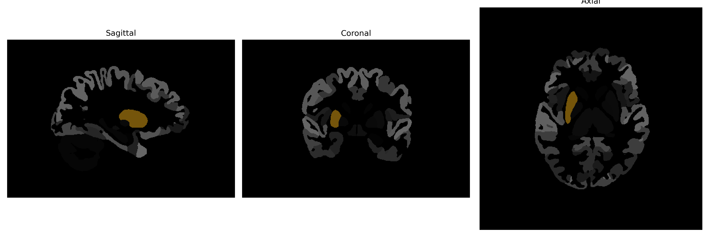

# Putamen

## Overview

The right putamen is a rounded structure located at the base of the forebrain, part of the lentiform nucleus and the basal ganglia. It plays a crucial role in a variety of functions including motor control, learning, and reward processing. The putamen receives and integrates sensory and motor signals, interacting closely with the caudate nucleus and globus pallidus. It forms part of the extrapyramidal motor system, which contributes to the modulation and coordination of movement. Neurotransmitters such as dopamine have significant roles in its function, influencing cognitive processes and emotion.

There is no direct Wikipedia link to this specific description; however, more general information about the structure it is a part of can be found here: https://en.wikipedia.org/wiki/Putamen

*Overview generated by GPT-4o (2026).*

---

**Region ID:** 13  
**Hemisphere:** Right  
**Atlas:** brainCOLOR 

---

## Full Brain – Black Background

**Full Quality Version:** [Download MP4](full_black.mp4)

---

## Full Brain – White Background

**Full Quality Version:** [Download MP4](full_white.mp4)

---

## Hemisphere Only – Black Background

**Full Quality Version:** [Download MP4](hemi_black.mp4)

---

## Hemisphere Only – White Background

**Full Quality Version:** [Download MP4](hemi_white.mp4)

---

## Triplanar View (Centered on ROI)

