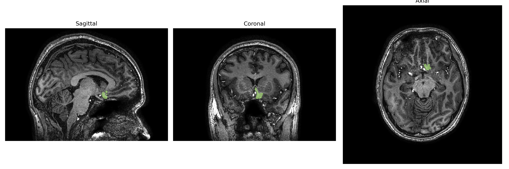
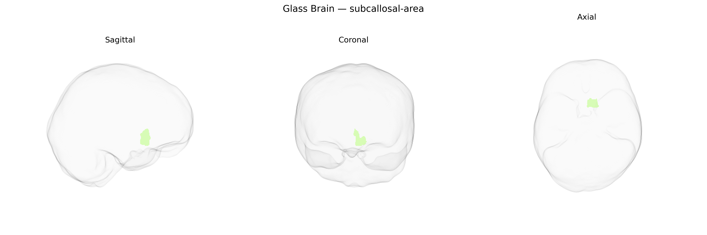

# subcallosal-area

## Overview

The left subcallosal area is a ventromedial prefrontal cortical region located inferior to the rostrum and genu of the corpus callosum, within the basal portion of the frontal lobe and often considered part of the subgenual/ventral anterior cingulate and medial orbitofrontal complex. Cytoarchitectonically, it includes cortex adjacent to the septal region and is closely associated with Brodmann areas 25 and parts of 24/32, and it is richly interconnected with limbic structures such as the amygdala, hippocampus, hypothalamus, and nucleus accumbens, as well as other prefrontal territories. Functionally, the subcallosal area participates in regulation of mood, emotional salience, autonomic and neuroendocrine responses, and is implicated in affective disorders, particularly major depression, where it has been a target for deep brain stimulation and other neuromodulatory therapies. There is no direct Wikipedia entry titled “Left subcallosal area”; a closely related and encompassing structure is the subgenual anterior cingulate cortex: https://en.wikipedia.org/wiki/Subgenual_anterior_cingulate_cortex.

*Overview generated by GPT-4o (2026).*

---

**Region ID:** 103  
**Hemisphere:** Left  
**Atlas:** brainCOLOR 

---

## subcallosal-area – Black Background (Full Brain)

**Full Quality Version:** [Download MP4](full_black.mp4)

---

## subcallosal-area – White Background (Full Brain)

**Full Quality Version:** [Download MP4](full_white.mp4)

---

## subcallosal-area – Black Background (Hemisphere)

**Full Quality Version:** [Download MP4](hemi_black.mp4)

---

## subcallosal-area – White Background (Hemisphere)

**Full Quality Version:** [Download MP4](hemi_white.mp4)

---

## Triplanar View – T1 Background

---

## Triplanar View – Ghost Brain


