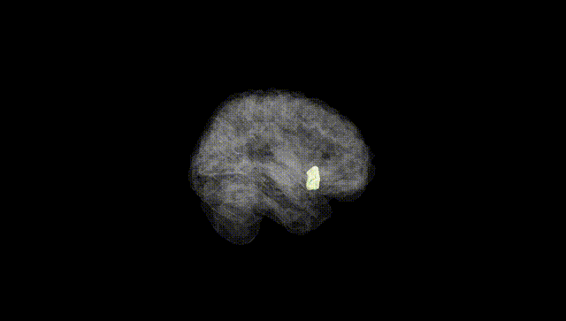
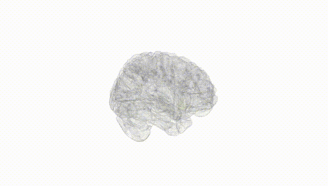
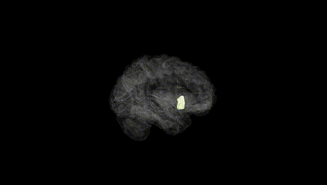
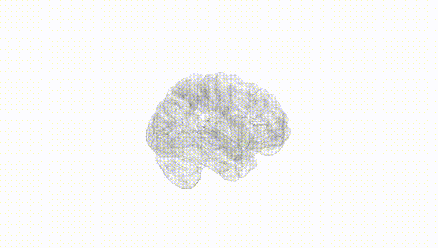
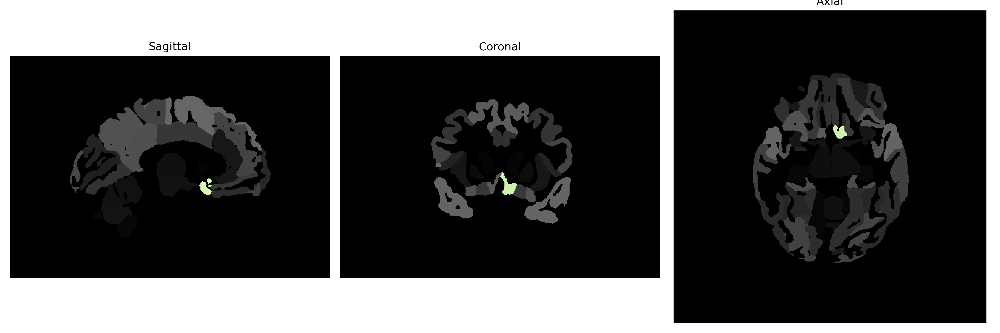

# subcallosal-area

## Overview

The Left subcallosal area, also known as Brodmann area 25, is a small region located in the basal forebrain and is part of the limbic system. It is situated beneath the body of the corpus callosum, adjacent to the cingulate gyrus. This area is characterized by a thin layer of granule cells, making it a distinct cortical area involved in emotional processing, mood regulation, and autonomic function. It has been implicated in mood disorders such as depression due to its connections with other limbic and prefrontal regions. 

There is no direct Wikipedia link specifically for the "Left subcallosal-area," but more information can be found on Brodmann area 25: https://en.wikipedia.org/wiki/Brodmann_area_25.

*Overview generated by GPT-4o (2026).*

---

**Region ID:** 103  
**Hemisphere:** Left  
**Atlas:** brainCOLOR 

---

## Full Brain – Black Background

**Full Quality Version:** [Download MP4](full_black.mp4)

---

## Full Brain – White Background

**Full Quality Version:** [Download MP4](full_white.mp4)

---

## Hemisphere Only – Black Background

**Full Quality Version:** [Download MP4](hemi_black.mp4)

---

## Hemisphere Only – White Background

**Full Quality Version:** [Download MP4](hemi_white.mp4)

---

## Triplanar View (Centered on ROI)

