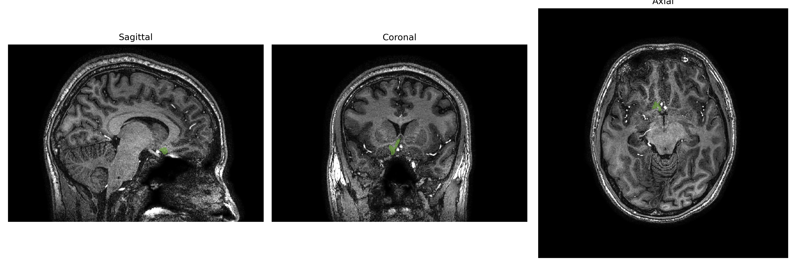
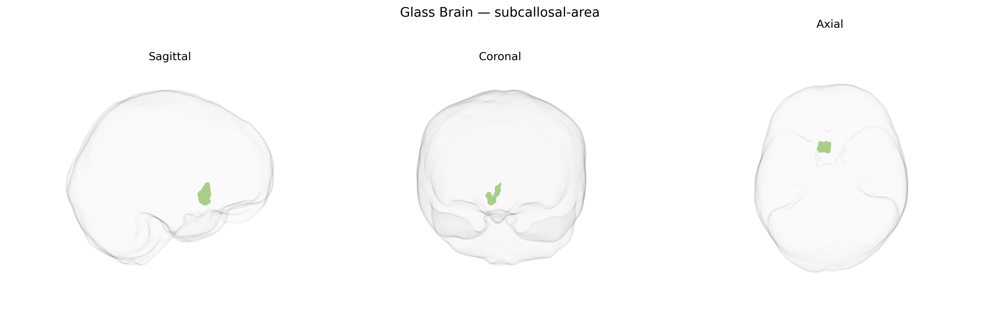

# subcallosal-area

## Overview

The right subcallosal area is a ventral medial prefrontal cortical region located inferior to the genu of the corpus callosum and anterior to the lamina terminalis, often associated with Brodmann area 25 (subgenual anterior cingulate cortex). It forms part of the limbic–cortical network, receiving and integrating inputs from the medial prefrontal cortex, anterior cingulate, amygdala, hippocampus, and hypothalamus, and projecting to brainstem and basal forebrain autonomic and monoaminergic nuclei. Cytoarchitectonically, it is characterized by a granular or dysgranular cortical organization and dense reciprocal connectivity with mood- and visceromotor-related structures. Functionally, the right subcallosal area is implicated in regulation of mood, affective valuation of internal states, autonomic and endocrine responses to emotional stimuli, and is a key target in studies and interventions for major depressive disorder, including deep brain stimulation. There is no direct Wikipedia link specifically for the “right subcallosal area” as defined in the brainCOLOR Atlas; a closely related and commonly referenced structure is the subgenual anterior cingulate cortex (Brodmann area 25): https://en.wikipedia.org/wiki/Subgenual_area.

*Overview generated by GPT-4o (2026).*

---

**Region ID:** 102  
**Hemisphere:** Right  
**Atlas:** brainCOLOR 

---

## subcallosal-area – Black Background (Full Brain)

**Full Quality Version:** [Download MP4](full_black.mp4)

---

## subcallosal-area – White Background (Full Brain)

**Full Quality Version:** [Download MP4](full_white.mp4)

---

## subcallosal-area – Black Background (Hemisphere)

**Full Quality Version:** [Download MP4](hemi_black.mp4)

---

## subcallosal-area – White Background (Hemisphere)

**Full Quality Version:** [Download MP4](hemi_white.mp4)

---

## Triplanar View – T1 Background

---

## Triplanar View – Ghost Brain


