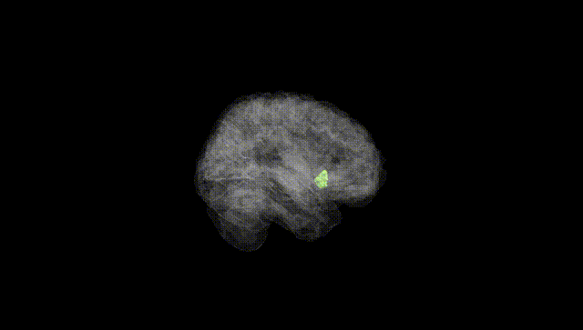
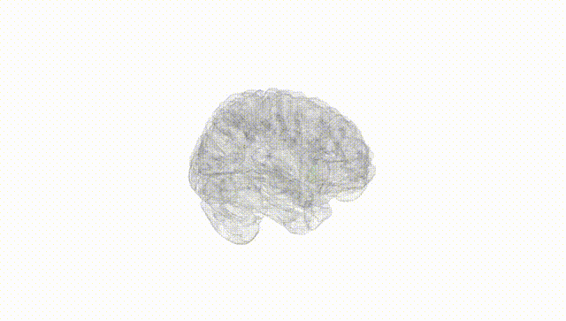
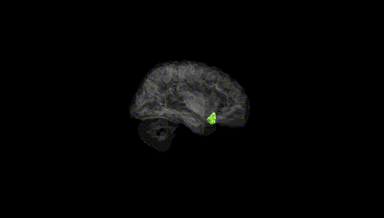
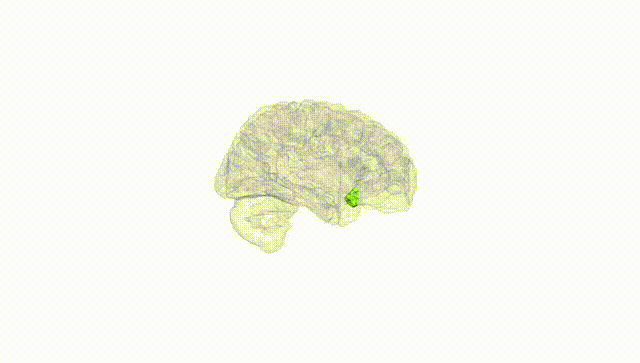
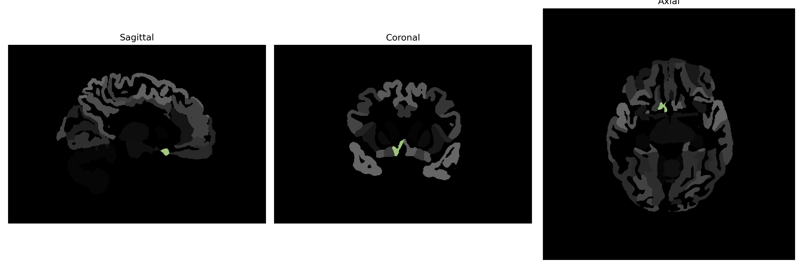

# subcallosal-area

## Overview

The Right subcallosal area is a region of the cerebral cortex located underneath the corpus callosum, in a location known as the subgenual region of the cingulate cortex. It is involved in various functions including mood and emotional regulation, often studied in the context of its connections with other parts of the brain related to depression and other affective disorders. Anatomically, it is part of the limbic system, which plays a crucial role in emotion processing. The subcallosal area has also been a target for deep brain stimulation therapies due to its involvement in affective processes.

There is no direct Wikipedia link specifically for the Right subcallosal area. However, for more information related to this region, one can refer to the page on the [Subgenual anterior cingulate cortex](https://en.wikipedia.org/wiki/Subgenual_anterior_cingulate_cortex), which covers some of its functional and structural aspects.

*Overview generated by GPT-4o (2026).*

---

**Region ID:** 102  
**Hemisphere:** Right  
**Atlas:** brainCOLOR 

---

## Full Brain – Black Background

**Full Quality Version:** [Download MP4](full_black.mp4)

---

## Full Brain – White Background

**Full Quality Version:** [Download MP4](full_white.mp4)

---

## Hemisphere Only – Black Background

**Full Quality Version:** [Download MP4](hemi_black.mp4)

---

## Hemisphere Only – White Background

**Full Quality Version:** [Download MP4](hemi_white.mp4)

---

## Triplanar View (Centered on ROI)

