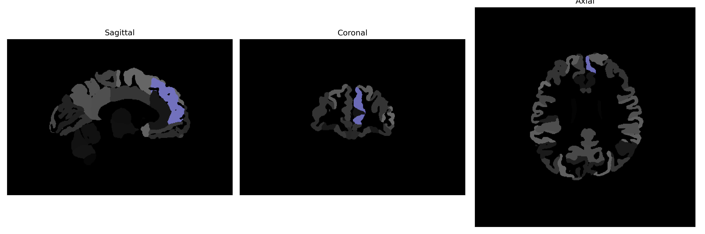

# superior-frontal-gyrus-medial-segment

## Overview

The Left Superior Frontal Gyrus Medial Segment is a distinct segment within the superior frontal gyrus, situated in the frontal lobe of the human brain. This region plays a crucial role in higher cognitive functions such as decision making, self-awareness, and executive processes. It is part of the prefrontal cortex and is involved in complex aspects of memory, attention, and the regulation of emotional responses. Being in the medial section, it also contributes to social cognition and moral reasoning. This part of the brain is significant for integrating emotional and cognitive experiences, helping to form judgments and responses based on various stimuli.

There is no direct Wikipedia link for the Left Superior Frontal Gyrus Medial Segment. However, a related structure can be explored here: [Superior Frontal Gyrus - Wikipedia](https://en.wikipedia.org/wiki/Superior_frontal_gyrus).

*Overview generated by GPT-4o (2026).*

---

**Region ID:** 71  
**Hemisphere:** Left  
**Atlas:** brainCOLOR 

---

## Full Brain – Black Background

**Full Quality Version:** [Download MP4](full_black.mp4)

---

## Full Brain – White Background

**Full Quality Version:** [Download MP4](full_white.mp4)

---

## Hemisphere Only – Black Background

**Full Quality Version:** [Download MP4](hemi_black.mp4)

---

## Hemisphere Only – White Background

**Full Quality Version:** [Download MP4](hemi_white.mp4)

---

## Triplanar View (Centered on ROI)

