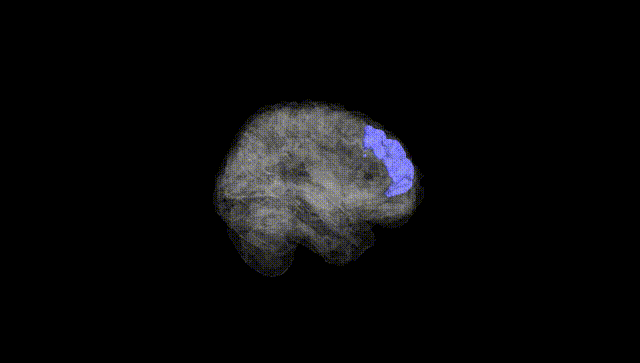
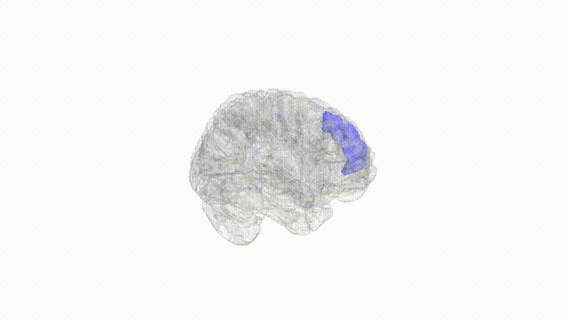
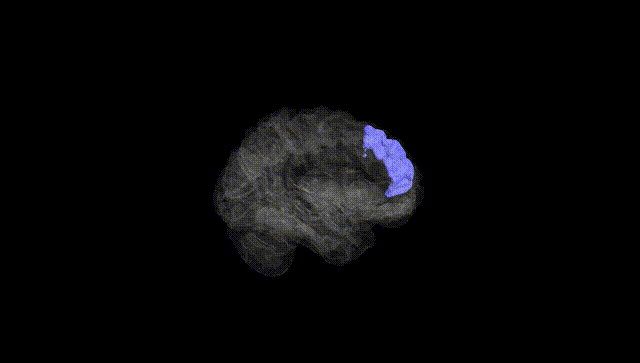
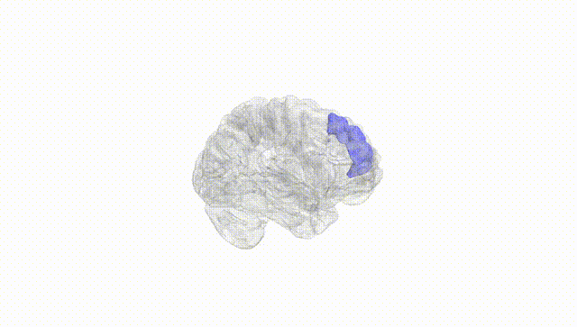
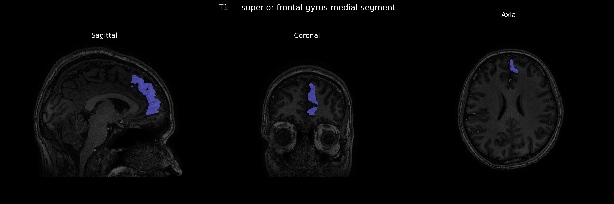
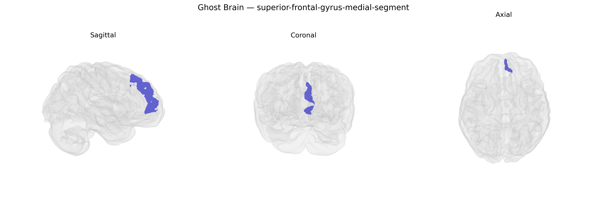

# superior-frontal-gyrus-medial-segment

## Overview

The Left superior frontal gyrus, medial segment, is a cortical region located on the medial aspect of the superior frontal gyrus within the frontal lobe, extending anteriorly from the supplementary motor area toward the frontal pole and bounded inferiorly by the cingulate sulcus. It is composed primarily of agranular and dysgranular frontal cortex and participates in higher-order executive functions, self-referential processing, and motor planning, including contributions to internally guided actions and aspects of working memory and decision-making. This region has dense reciprocal connections with other medial frontal areas (such as the anterior cingulate cortex and pre-supplementary motor area), lateral prefrontal cortices, and subcortical structures including the basal ganglia and thalamus, forming part of distributed frontal networks involved in cognitive control and voluntary behavior. There is no direct Wikipedia page for the “Left superior-frontal-gyrus-medial-segment” as labeled in the brainCOLOR Atlas; a closely related and encompassing structure is the superior frontal gyrus: https://en.wikipedia.org/wiki/Superior_frontal_gyrus.

*Overview generated by GPT-4o (2026).*

---

**Region ID:** 71  
**Hemisphere:** Left  
**Atlas:** brainCOLOR 

---

## Full Brain – Black Background

**Full Quality Version:** [Download MP4](full_black.mp4)

---

## Full Brain – White Background

**Full Quality Version:** [Download MP4](full_white.mp4)

---

## Hemisphere Only – Black Background

**Full Quality Version:** [Download MP4](hemi_black.mp4)

---

## Hemisphere Only – White Background

**Full Quality Version:** [Download MP4](hemi_white.mp4)

---

## Triplanar View – T1 Background

---

## Triplanar View – Ghost Brain


