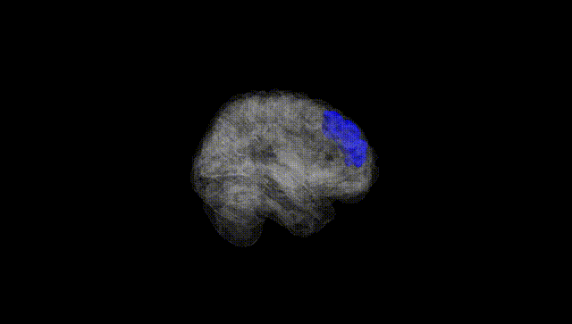
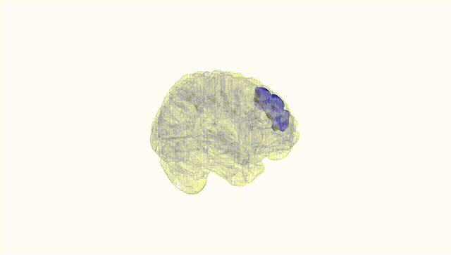
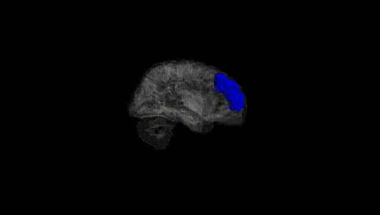
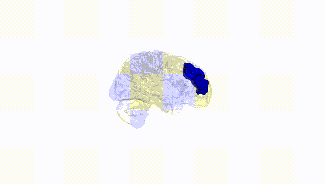
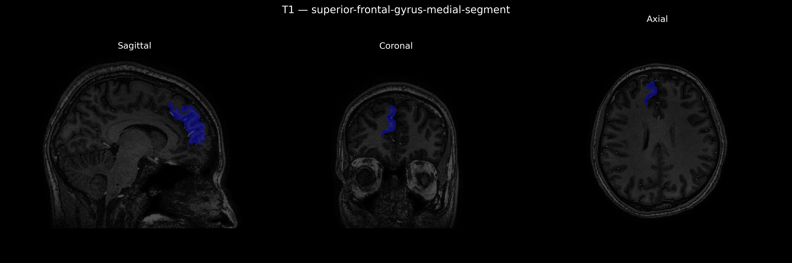
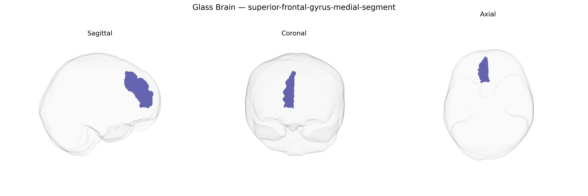

# superior-frontal-gyrus-medial-segment
 
## Overview
 
The Right superior-frontal-gyrus-medial-segment corresponds to the medial portion of the right superior frontal gyrus located on the medial surface of the frontal lobe, bordering the interhemispheric fissure and extending anteriorly from the supplementary motor complexes toward prefrontal territories. This region encompasses parts of medial prefrontal and premotor cortex, and is implicated in high-order executive functions, attention, working memory, and aspects of self-referential processing, as well as in motor planning through its connections with supplementary motor areas and cingulate cortex. Cytoarchitectonically, it overlaps primarily with medial aspects of Brodmann areas 8, 9, and possibly 10, and is richly interconnected with other frontal, parietal, and limbic regions via long-range association fibers. There is no direct Wikipedia article for this specific parcellation; a related entry describing the broader anatomical structure is [Superior frontal gyrus](https://en.wikipedia.org/wiki/Superior_frontal_gyrus).
 
The right superior frontal gyrus, medial segment (as delineated in the brainCOLOR atlas and overlapping medial prefrontal/superior frontal regions including parts of BA8/9/10/32) has been implicated in several imaging genetics and GWAS-based neuroimaging studies, though typically under broader labels such as medial prefrontal cortex or superior frontal cortical thickness/volume rather than this exact parcellation. Large-scale GWAS of cortical morphology (e.g., ENIGMA, UK Biobank) have reported associations between variants in genes involved in neurodevelopment and synaptic function (such as MIR137, MAPT region haplotypes, and loci near genes like POU3F2, DCC, and GRIN2A) and measures of superior frontal or medial prefrontal cortical thickness, surface area, or gyrification that encompass this region. Polygenic risk scores for schizophrenia, bipolar disorder, major depression, ADHD, and autism spectrum disorder show significant relationships with right superior frontal/medial prefrontal structure or activation during cognitive control, working memory, and emotion regulation tasks, suggesting that genetic liability for these disorders partly manifests through variation in this territory. Additionally, GWAS of personality traits (e.g., neuroticism, conscientiousness), general cognitive ability, educational attainment, and risk-taking have identified genetic variants whose imaging mediators include volume or functional connectivity of medial superior frontal cortex, including the right side. Some Alzheimer’s disease and frontotemporal dementia risk loci (e.g., in or near APOE, MAPT, and TMEM106B) have been linked to atrophy patterns that extend into medial superior frontal regions, although the right medial segment is not typically singled out. Overall, genetic findings support a role for this region as a convergence zone where common variants influencing higher-order cognition, affect regulation, and risk for major psychiatric and some neurodegenerative disorders exert measurable effects on brain structure and function, but no large GWAS to date has focused specifically and exclusively on the “right superior-frontal-gyrus-medial-segment” parcel as defined in the brainCOLOR atlas.
 
*Overview generated by GPT-4o (2026).*
 
---
 
**Region ID:** 70  
**Hemisphere:** Right  
**Atlas:** brainCOLOR 
 
---
 
## superior-frontal-gyrus-medial-segment – Black Background (Full Brain)
 

 
**Full Quality Version:** <a href="full_black.mp4" download>Download MP4</a>
 
---
 
## superior-frontal-gyrus-medial-segment – White Background (Full Brain)
 

 
**Full Quality Version:** <a href="full_white.mp4" download>Download MP4</a>
 
---

## superior-frontal-gyrus-medial-segment – Black Background (Hemisphere)
 

 
**Full Quality Version:** <a href="hemi_black.mp4" download>Download MP4</a>
 
---
 
## superior-frontal-gyrus-medial-segment – White Background (Hemisphere)
 

 
**Full Quality Version:** <a href="hemi_white.mp4" download>Download MP4</a>
 
---

## Triplanar View – T1 Background
 

 
---
 
## Triplanar View – Ghost Brain
 


