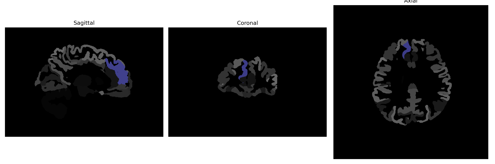

# superior-frontal-gyrus-medial-segment

## Overview

The Right superior-frontal-gyrus-medial-segment is a cerebral cortex region located in the frontal lobe, known for its involvement in higher cognitive functions. This brain region plays a crucial role in self-awareness, executive functions, and aspects of personality and decision-making processes. Anatomically, it is situated along the superior frontal gyrus, particularly on the medial aspect, and forms a portion of the medial prefrontal cortex. This segment is involved in processing complex cognitions and emotions, contributing to the regulation of social behavior and goal-oriented tasks. Its interconnectedness with other brain regions supports its role in integrating sensory perceptions with memory and reasoning.

There is no direct link to this specific description on Wikipedia. However, for related information, the following link to the superior frontal gyrus can be provided: https://en.wikipedia.org/wiki/Superior_frontal_gyrus.

*Overview generated by GPT-4o (2026).*

---

**Region ID:** 70  
**Hemisphere:** Right  
**Atlas:** brainCOLOR 

---

## Full Brain – Black Background

**Full Quality Version:** [Download MP4](full_black.mp4)

---

## Full Brain – White Background

**Full Quality Version:** [Download MP4](full_white.mp4)

---

## Hemisphere Only – Black Background

**Full Quality Version:** [Download MP4](hemi_black.mp4)

---

## Hemisphere Only – White Background

**Full Quality Version:** [Download MP4](hemi_white.mp4)

---

## Triplanar View (Centered on ROI)

