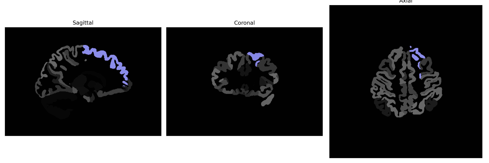

# superior-frontal-gyrus

## Overview

The left superior-frontal-gyrus is a brain region located within the frontal lobe, specifically in the superior section of the prefrontal cortex. This gyrus plays a crucial role in higher cognitive functions such as decision-making, attention, and working memory. Functionally, it is involved in the control of voluntary movement and is linked to the planning and execution of behavior. The left superior-frontal-gyrus is known to integrate sensory information with planned motor actions, significantly involved in self-awareness and problem-solving. It is often studied in relation to various neurological and psychiatric disorders. 

There is no direct link to the precise description in the brainCOLOR Atlas; however, more information on the frontal lobe and its functions can be found at the following Wikipedia link: [Frontal Lobe](https://en.wikipedia.org/wiki/Frontal_lobe).

*Overview generated by GPT-4o (2026).*

---

**Region ID:** 105  
**Hemisphere:** Left  
**Atlas:** brainCOLOR 

---

## Full Brain – Black Background

**Full Quality Version:** [Download MP4](full_black.mp4)

---

## Full Brain – White Background

**Full Quality Version:** [Download MP4](full_white.mp4)

---

## Hemisphere Only – Black Background

**Full Quality Version:** [Download MP4](hemi_black.mp4)

---

## Hemisphere Only – White Background

**Full Quality Version:** [Download MP4](hemi_white.mp4)

---

## Triplanar View (Centered on ROI)

