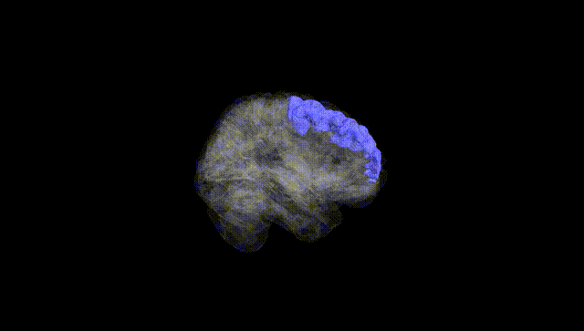
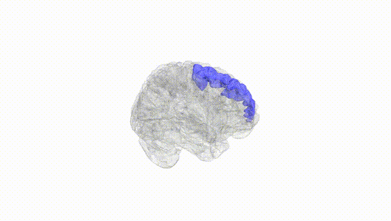
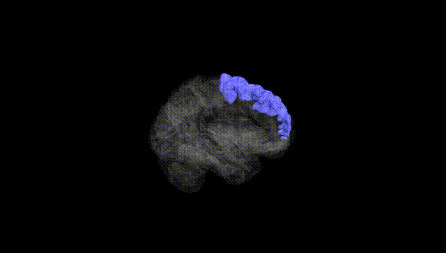
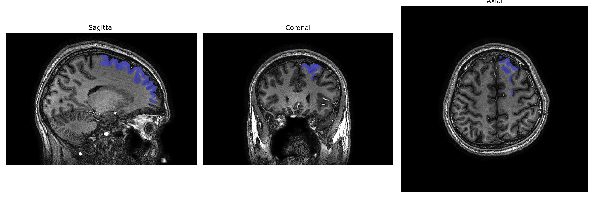
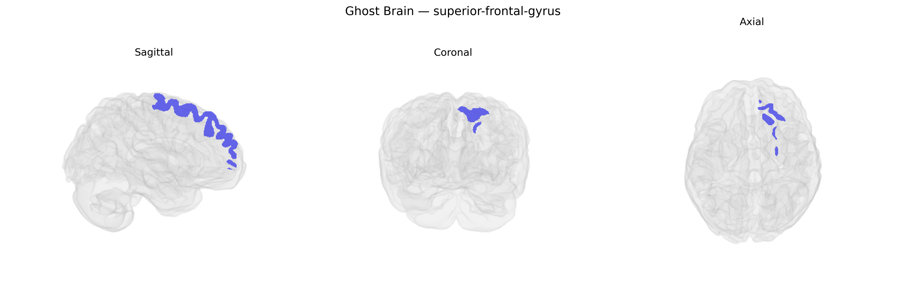

# superior-frontal-gyrus
 
## Overview
 
The Left superior-frontal-gyrus is a dorsal prefrontal cortical region located in the superior aspect of the frontal lobe, extending anteriorly from the precentral gyrus toward the frontal pole and bounded medially by the interhemispheric fissure. Cytoarchitectonically, it encompasses portions of medial and dorsolateral prefrontal areas implicated in higher-order executive functions, including working memory, attentional control, planning, and monitoring of goal-directed behavior, as well as aspects of self-referential processing and decision-making. This gyrus contributes to large-scale networks such as the frontoparietal control network and, more medially, to components of the default mode network, and shows strong connectivity with premotor, parietal, and limbic regions. Hemispheric lateralization in the left superior frontal gyrus is often associated with language-related executive processes and verbal working memory. [Superior frontal gyrus](https://en.wikipedia.org/wiki/Superior_frontal_gyrus)
 
The left superior frontal gyrus, as defined in the brainCOLOR atlas, has been implicated in several genetic and GWAS findings primarily through large-scale imaging-genetics consortia such as ENIGMA and UK Biobank–based studies that relate common variants to cortical thickness, surface area, and volume. Variants near genes involved in neurodevelopment and synaptic function (for example, microtubule and axon guidance genes, and loci in pathways for neuronal differentiation and plasticity) have shown associations with structural measures of this region, though most effects are small and highly polygenic. GWAS of major depressive disorder, schizophrenia, bipolar disorder, ADHD, and autism spectrum disorder report case–control differences and polygenic risk score correlations in left superior frontal cortical metrics, indicating that genetic liability to these disorders partly manifests in this area’s structure and connectivity, but no single locus is uniquely or specifically tied to this gyrus. Additionally, genetic studies of cognitive traits (general intelligence, working memory, educational attainment) show that polygenic scores for these traits correlate with morphology and activation patterns in the superior frontal cortex, suggesting shared genetic architecture between cognitive performance and the structural organization of this region. Overall, current evidence points to the left superior frontal gyrus as a convergent target of highly distributed genetic influences relevant to higher-order cognition and psychiatric risk, rather than a region defined by a small number of strong, region-specific genetic associations.
 
*Overview generated by GPT-4o (2026).*
 
---
 
**Region ID:** 105  
**Hemisphere:** Left  
**Atlas:** brainCOLOR 
 
---
 
## superior-frontal-gyrus – Black Background (Full Brain)
 

 
**Full Quality Version:** <a href="full_black.mp4" download>Download MP4</a>
 
---
 
## superior-frontal-gyrus – White Background (Full Brain)
 

 
**Full Quality Version:** <a href="full_white.mp4" download>Download MP4</a>
 
---

## superior-frontal-gyrus – Black Background (Hemisphere)
 

 
**Full Quality Version:** <a href="hemi_black.mp4" download>Download MP4</a>
 
---
 
## superior-frontal-gyrus – White Background (Hemisphere)
 

 
**Full Quality Version:** <a href="hemi_white.mp4" download>Download MP4</a>
 
---

## Triplanar View – T1 Background
 

 
---
 
## Triplanar View – Ghost Brain
 


