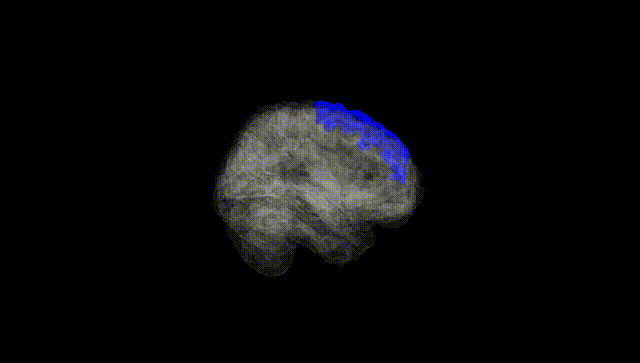
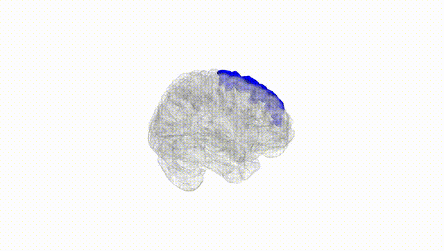
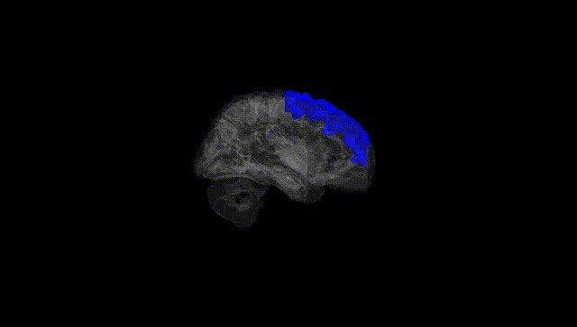
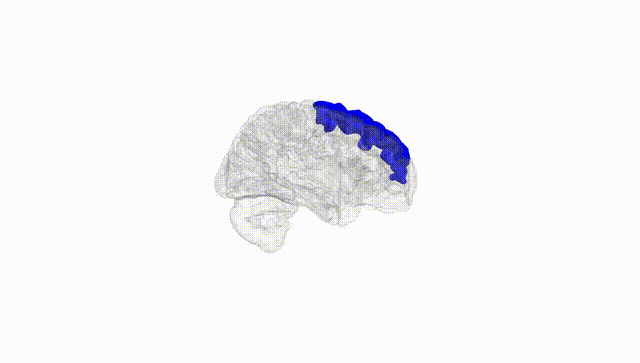
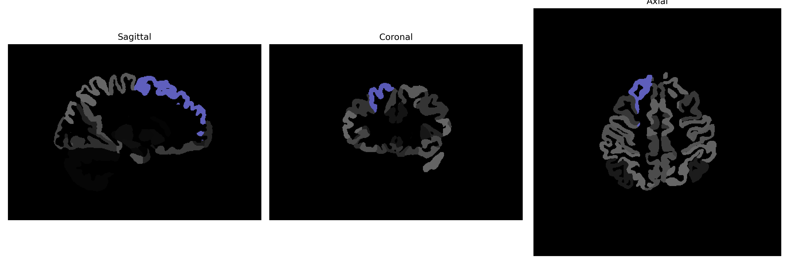

# superior-frontal-gyrus

## Overview

The Right Superior Frontal Gyrus is a prominent structure within the frontal lobe of the human brain, situated dorsally in the prefrontal cortex. It plays a critical role in various higher cognitive functions such as self-awareness, working memory, attention, and decision-making processes. Anatomically, it runs parallel to the longitudinal fissure and is bounded inferiorly by the superior frontal sulcus. This gyrus is also implicated in motor function and is actively involved in complex cognitive tasks that require planning and organization. The Right Superior Frontal Gyrus is thought to contribute significantly to the integrative processing of behavioral and emotional responses, thereby influencing personality and complex social interactions.

There is no direct Wikipedia link to the Right Superior Frontal Gyrus. However, more information about the superior frontal gyrus can be found on its Wikipedia page: [Superior Frontal Gyrus Wikipedia](https://en.wikipedia.org/wiki/Superior_frontal_gyrus).

*Overview generated by GPT-4o (2026).*

---

**Region ID:** 104  
**Hemisphere:** Right  
**Atlas:** brainCOLOR 

---

## Full Brain – Black Background

**Full Quality Version:** [Download MP4](full_black.mp4)

---

## Full Brain – White Background

**Full Quality Version:** [Download MP4](full_white.mp4)

---

## Hemisphere Only – Black Background

**Full Quality Version:** [Download MP4](hemi_black.mp4)

---

## Hemisphere Only – White Background

**Full Quality Version:** [Download MP4](hemi_white.mp4)

---

## Triplanar View (Centered on ROI)

