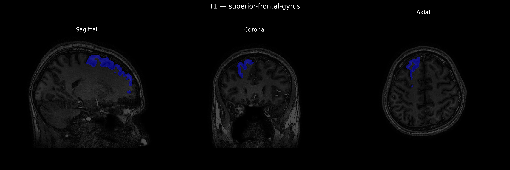
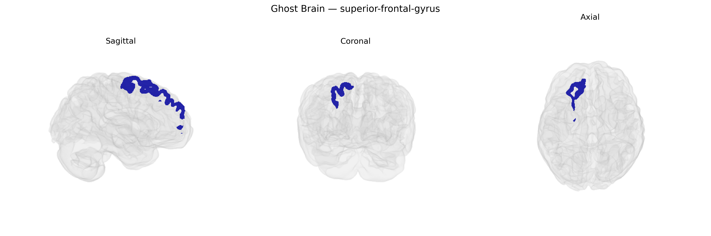

# superior-frontal-gyrus

## Overview

The right superior frontal gyrus is a longitudinal convolution in the dorsal aspect of the frontal lobe, extending anteriorly from the precentral sulcus toward the frontal pole and bounded medially by the longitudinal fissure and laterally by the superior frontal sulcus. It participates in higher-order cognitive and executive functions, including aspects of working memory, attention control, decision-making, and metacognition, and contributes to motor planning through connections with premotor and supplementary motor areas. Cytoarchitectonically, it encompasses portions of the dorsolateral prefrontal cortex and medial prefrontal cortex, receiving and sending extensive projections to other frontal, parietal, limbic, and subcortical structures involved in goal-directed behavior and self-regulation. There is no direct Wikipedia link for the “Right superior frontal gyrus” as a hemisphere-specific entry; a closely related structure with a general description is the superior frontal gyrus: https://en.wikipedia.org/wiki/Superior_frontal_gyrus.

*Overview generated by GPT-4o (2026).*

---

**Region ID:** 104  
**Hemisphere:** Right  
**Atlas:** brainCOLOR 

---

## Full Brain – Black Background

**Full Quality Version:** [Download MP4](full_black.mp4)

---

## Full Brain – White Background

**Full Quality Version:** [Download MP4](full_white.mp4)

---

## Hemisphere Only – Black Background

**Full Quality Version:** [Download MP4](hemi_black.mp4)

---

## Hemisphere Only – White Background

**Full Quality Version:** [Download MP4](hemi_white.mp4)

---

## Triplanar View – T1 Background

---

## Triplanar View – Ghost Brain


