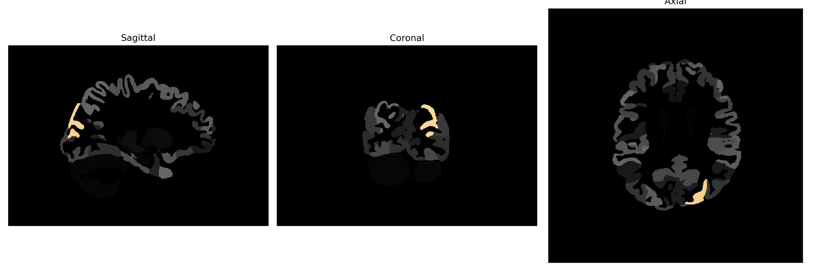

# superior-occipital-gyrus

## Overview

The Left Superior Occipital Gyrus is a distinct structural region of the human brain located in the occipital lobe, which plays a critical role in visual processing and interpretation. It is part of the superior division of the occipital cortex, contributing to the integration of visual information received from the retina, and working in tandem with other areas of the brain to form coherent visual perceptions. This gyrus is involved in high-level visual processing tasks and is connected to networks responsible for spatial orientation and the perception of movement. In the context of the brainCOLOR Atlas, it would be specifically designated as a color-coded area, highlighting its anatomical and functional relevance in visual cognition studies.

There is no direct Wikipedia link for the Left Superior Occipital Gyrus, but a related link to the larger occipital lobe can be provided: [Occipital Lobe - Wikipedia](https://en.wikipedia.org/wiki/Occipital_lobe).

*Overview generated by GPT-4o (2026).*

---

**Region ID:** 111  
**Hemisphere:** Left  
**Atlas:** brainCOLOR 

---

## Full Brain – Black Background

**Full Quality Version:** [Download MP4](full_black.mp4)

---

## Full Brain – White Background

**Full Quality Version:** [Download MP4](full_white.mp4)

---

## Hemisphere Only – Black Background

**Full Quality Version:** [Download MP4](hemi_black.mp4)

---

## Hemisphere Only – White Background

**Full Quality Version:** [Download MP4](hemi_white.mp4)

---

## Triplanar View (Centered on ROI)

