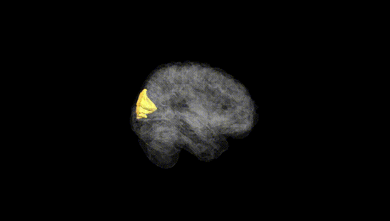
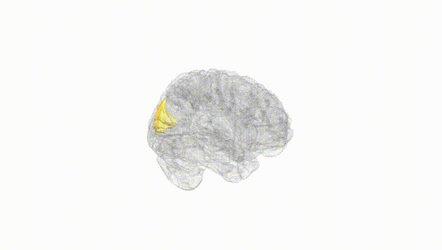
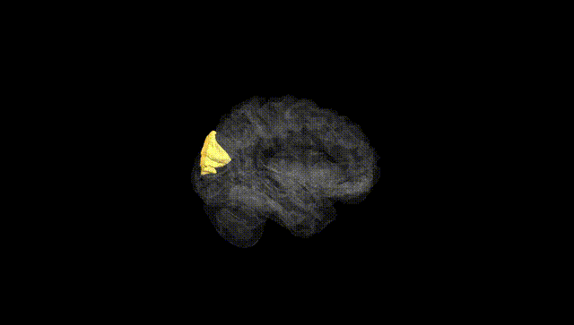
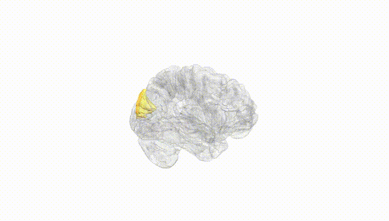
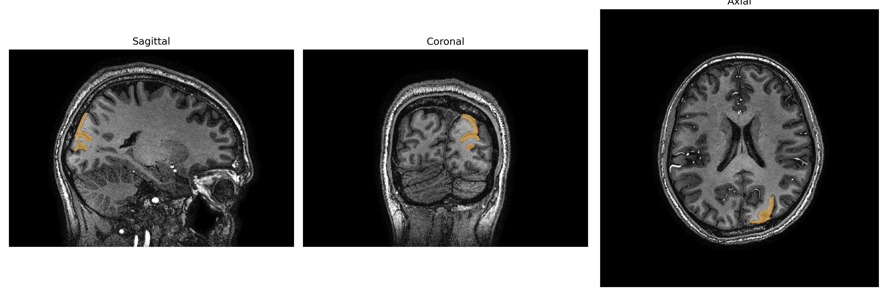
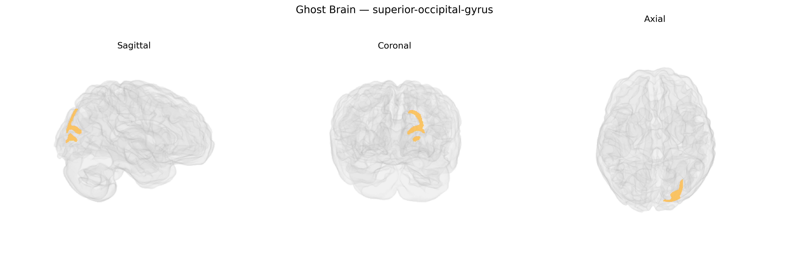

# superior-occipital-gyrus
 
## Overview
 
The Left superior-occipital-gyrus is a dorsal subdivision of the occipital lobe located on the lateral surface of the cerebral hemisphere, superior to the calcarine sulcus and extending toward the parietal lobe. It is primarily involved in higher-order aspects of visual processing, including integration of visual features, visuospatial analysis, and contributions to visually guided attention and eye movements. This region participates in large-scale dorsal visual stream networks that support spatial orientation and motion perception, and it interacts with parietal and frontal areas to facilitate sensorimotor transformations of visual information. There is no direct Wikipedia article for the Left superior-occipital-gyrus; a related structure is the [Occipital lobe](https://en.wikipedia.org/wiki/Occipital_lobe).
 
Genetic associations specific to the left superior occipital gyrus (SOG) as defined in the brainCOLOR atlas are not well characterized at a fine-grained regional level, but several large neuroimaging GWAS and cortical-morphometry studies implicate overlapping occipital and superior occipital regions in genetically influenced variation of cortical thickness, surface area, and volume. Common variants near genes involved in neurodevelopment, synaptic function, and neuronal migration (for example, loci near PAX6, TBR1, and other occipital-enriched developmental genes) have been associated with occipital lobe structure, although such signals are usually reported at broader regional scales (e.g., “lateral occipital” or “occipital cortex”) rather than the left SOG specifically. Occipital cortex measures that include or approximate the superior occipital gyrus show heritability and have been linked via GWAS to cognitive traits (such as general cognitive ability and visual processing measures), as well as to risk for neurodevelopmental and psychiatric conditions where visual and visuospatial processing are affected, including autism spectrum disorder and schizophrenia, though these associations are generally indirect and regionally coarse. Overall, current genetic evidence supports a polygenic influence on structural variation in the occipital cortex that likely extends to the left SOG, but direct, high-confidence locus–phenotype mappings for this exact brainCOLOR-defined region remain sparse and are typically inferred from broader occipital or visual cortical GWAS results.
 
*Overview generated by GPT-4o (2026).*
 
---
 
**Region ID:** 111  
**Hemisphere:** Left  
**Atlas:** brainCOLOR 
 
---
 
## superior-occipital-gyrus – Black Background (Full Brain)
 

 
**Full Quality Version:** <a href="full_black.mp4" download>Download MP4</a>
 
---
 
## superior-occipital-gyrus – White Background (Full Brain)
 

 
**Full Quality Version:** <a href="full_white.mp4" download>Download MP4</a>
 
---

## superior-occipital-gyrus – Black Background (Hemisphere)
 

 
**Full Quality Version:** <a href="hemi_black.mp4" download>Download MP4</a>
 
---
 
## superior-occipital-gyrus – White Background (Hemisphere)
 

 
**Full Quality Version:** <a href="hemi_white.mp4" download>Download MP4</a>
 
---

## Triplanar View – T1 Background
 

 
---
 
## Triplanar View – Ghost Brain
 


