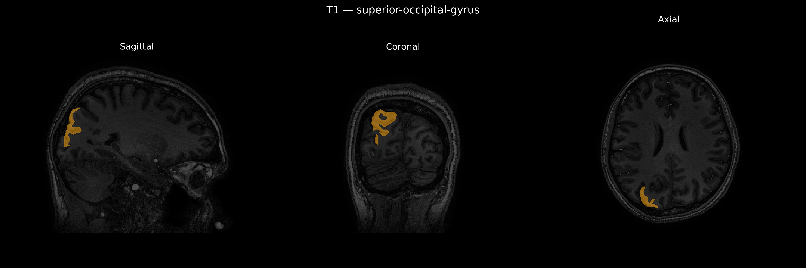
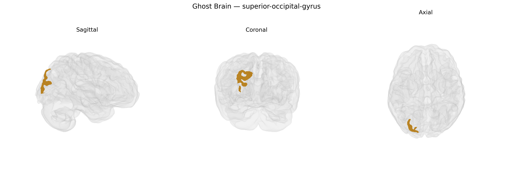

# superior-occipital-gyrus

## Overview

The right superior occipital gyrus is a dorsal occipital lobe structure located on the lateral and medial surfaces of the right hemisphere, superior to the transverse occipital sulcus and extending anteriorly toward the parieto‐occipital region. It is primarily composed of visual association cortex and participates in higher-order visual processing, including aspects of spatial orientation, motion analysis, and visuospatial attention, integrating visual inputs with parietal networks involved in spatial representation and visually guided behavior. Cytoarchitectonically, it corresponds largely to portions of Brodmann areas 18 and 19, receiving dense feedforward projections from primary visual cortex (V1) and sending outputs to dorsal stream regions in the parietal lobe. There is no direct Wikipedia entry for the “right superior occipital gyrus”; a related structure with an entry is the occipital lobe: https://en.wikipedia.org/wiki/Occipital_lobe.

*Overview generated by GPT-4o (2026).*

---

**Region ID:** 110  
**Hemisphere:** Right  
**Atlas:** brainCOLOR 

---

## Full Brain – Black Background

**Full Quality Version:** [Download MP4](full_black.mp4)

---

## Full Brain – White Background

**Full Quality Version:** [Download MP4](full_white.mp4)

---

## Hemisphere Only – Black Background

**Full Quality Version:** [Download MP4](hemi_black.mp4)

---

## Hemisphere Only – White Background

**Full Quality Version:** [Download MP4](hemi_white.mp4)

---

## Triplanar View – T1 Background

---

## Triplanar View – Ghost Brain


