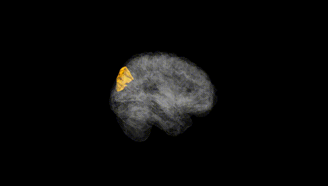
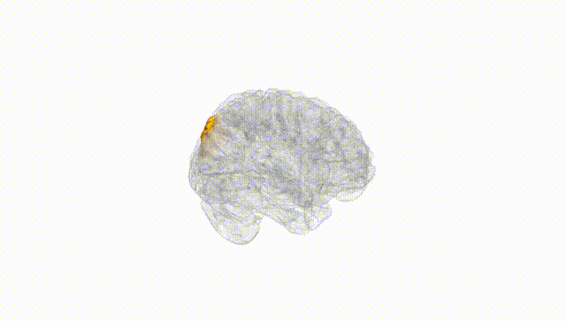
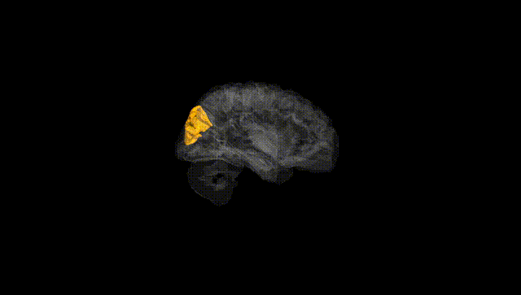
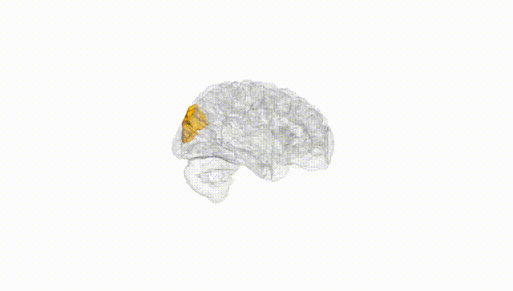
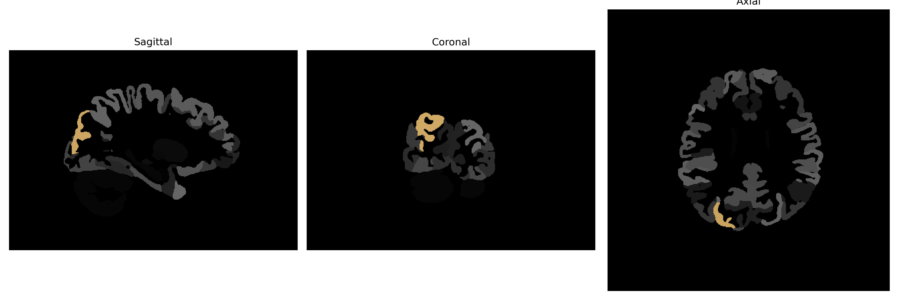

# superior-occipital-gyrus

## Overview

The Right Superior-Occipital Gyrus is a region located in the occipital lobe of the brain, responsible for processing visual information and participating in visual perception tasks. It contributes to higher-level processing of visual stimuli, such as the recognition of shapes and the detection of motion. This gyrus is interconnected with other areas of the brain through complex neural networks responsible for integrating visual inputs into coherent perceptual experiences. Its function relies heavily on its ability to communicate efficiently with neighboring regions, particularly within the occipital cortex, to support detailed and dynamic visual processing.

There is no direct Wikipedia link for the Right Superior-Occipital Gyrus. However, more information about the occipital lobe, which houses this region, can be found here: https://en.wikipedia.org/wiki/Occipital_lobe.

*Overview generated by GPT-4o (2026).*

---

**Region ID:** 110  
**Hemisphere:** Right  
**Atlas:** brainCOLOR 

---

## Full Brain – Black Background

**Full Quality Version:** [Download MP4](full_black.mp4)

---

## Full Brain – White Background

**Full Quality Version:** [Download MP4](full_white.mp4)

---

## Hemisphere Only – Black Background

**Full Quality Version:** [Download MP4](hemi_black.mp4)

---

## Hemisphere Only – White Background

**Full Quality Version:** [Download MP4](hemi_white.mp4)

---

## Triplanar View (Centered on ROI)

