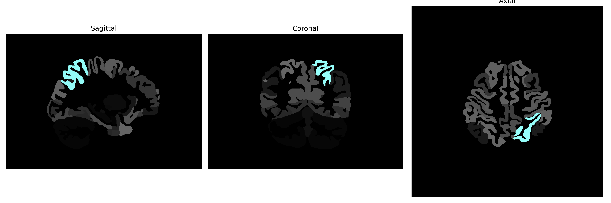

# superior-parietal-lobule

## Overview

The Left superior-parietal-lobule is a region in the parietal lobe of the brain, associated with various cognitive functions including spatial awareness, attention, and the integration of sensory information from different modalities. It is involved in the coordination of motor control and plays a critical role in complex processes such as spatial reasoning, navigation, and the manipulation of objects. Functionally, it contributes to the mental representation of the body in space, facilitating tasks that require visuospatial processing and the integration of sensory inputs for perception and movement execution. Anatomically, it lies adjacent to the intraparietal sulcus and extends towards the dorsal surface of the cerebral cortex, forming part of the broader parietal lobe system that integrates sensory information to support cognitive and perceptual tasks.

There is no direct Wikipedia link specifically for the Left superior-parietal-lobule from the brainCOLOR Atlas, but a related structure within the parietal lobe can be explored through this general link: [Parietal lobe - Wikipedia](https://en.wikipedia.org/wiki/Parietal_lobe).

*Overview generated by GPT-4o (2026).*

---

**Region ID:** 113  
**Hemisphere:** Left  
**Atlas:** brainCOLOR 

---

## Full Brain – Black Background

**Full Quality Version:** [Download MP4](full_black.mp4)

---

## Full Brain – White Background

**Full Quality Version:** [Download MP4](full_white.mp4)

---

## Hemisphere Only – Black Background

**Full Quality Version:** [Download MP4](hemi_black.mp4)

---

## Hemisphere Only – White Background

**Full Quality Version:** [Download MP4](hemi_white.mp4)

---

## Triplanar View (Centered on ROI)

