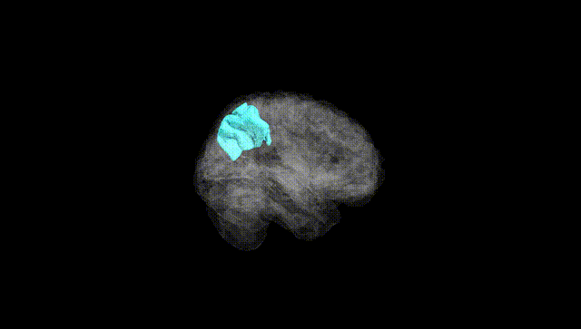
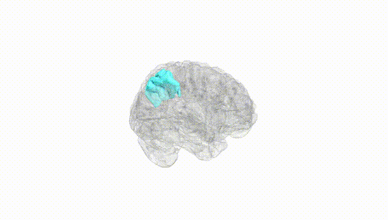
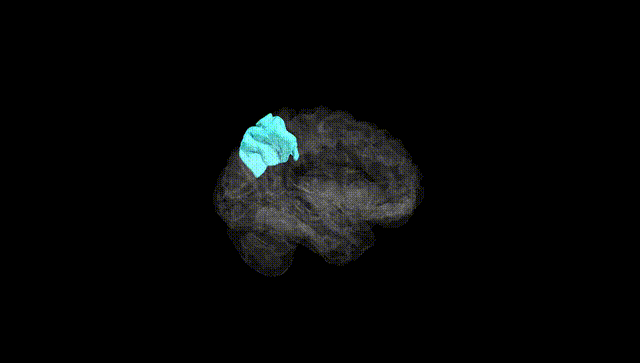
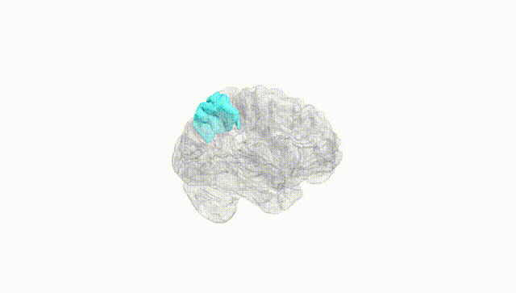
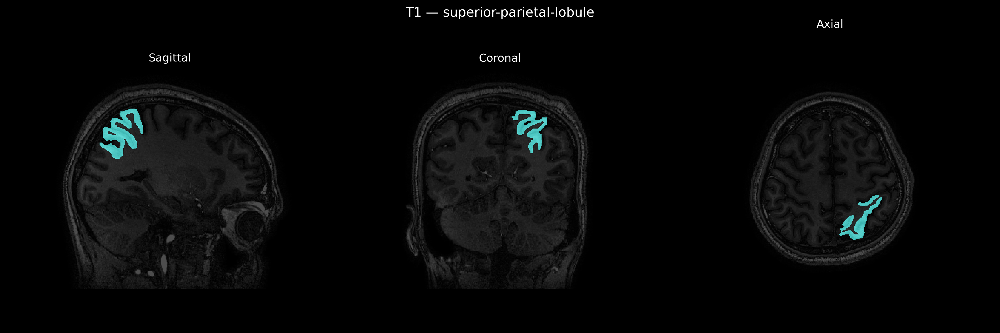
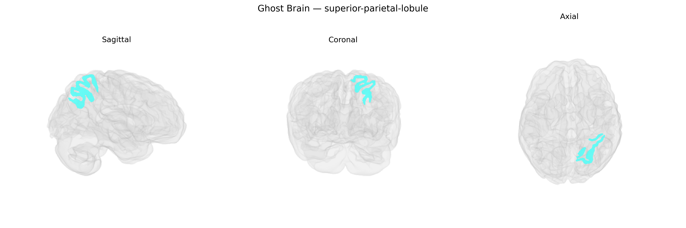

# superior-parietal-lobule

## Overview

The left superior parietal lobule (Left-SPL) is a dorsal parietal cortex region situated posterior to the postcentral gyrus and superior to the intraparietal sulcus within the parietal lobe of the left hemisphere. It is primarily associated with multimodal integration of somatosensory, visual, and proprioceptive information, supporting functions such as spatial attention, sensorimotor coordination, body schema representation, and visuomotor transformations for goal-directed actions. Cytoarchitectonically, it encompasses parts of Brodmann areas 5 and 7, receiving inputs from primary and secondary somatosensory cortices, visual association areas, and premotor regions, and projecting to frontal motor and premotor cortices as well as subcortical structures involved in motor planning. Damage to the left superior parietal lobule can lead to deficits in spatial perception and praxis, including ideomotor apraxia and disturbances in coordinated limb movements despite preserved primary motor strength. There is no direct Wikipedia page for the “Left superior-parietal-lobule” as defined in the brainCOLOR Atlas; a closely related and encompassing structure is described at: https://en.wikipedia.org/wiki/Superior_parietal_lobule.

*Overview generated by GPT-4o (2026).*

---

**Region ID:** 113  
**Hemisphere:** Left  
**Atlas:** brainCOLOR 

---

## Full Brain – Black Background

**Full Quality Version:** [Download MP4](full_black.mp4)

---

## Full Brain – White Background

**Full Quality Version:** [Download MP4](full_white.mp4)

---

## Hemisphere Only – Black Background

**Full Quality Version:** [Download MP4](hemi_black.mp4)

---

## Hemisphere Only – White Background

**Full Quality Version:** [Download MP4](hemi_white.mp4)

---

## Triplanar View – T1 Background

---

## Triplanar View – Ghost Brain


