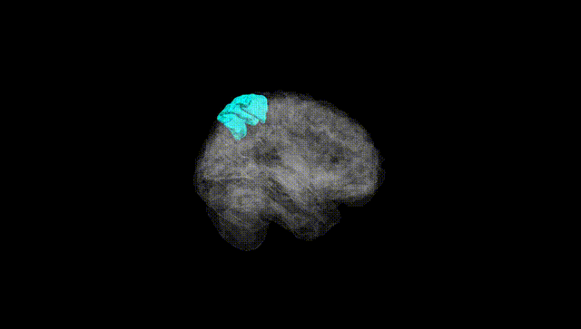
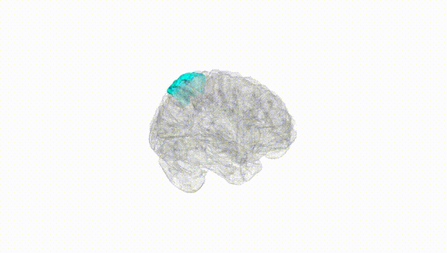
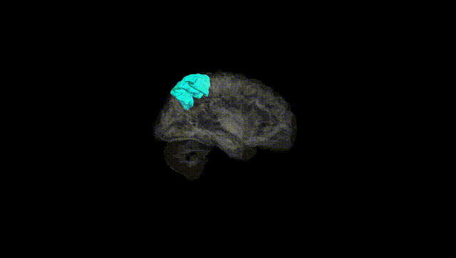
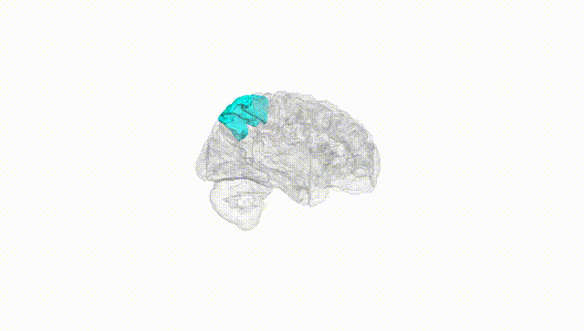
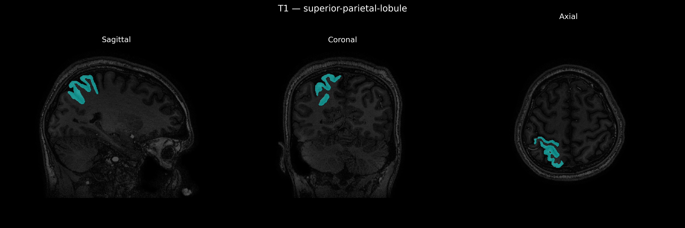
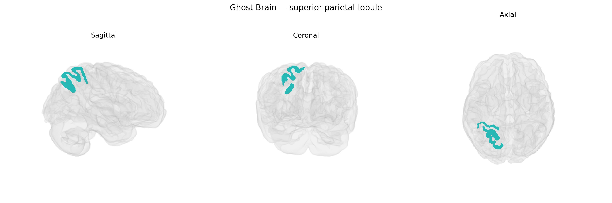

# superior-parietal-lobule

## Overview

The right superior parietal lobule (brainCOLOR Atlas region) is a dorsal parietal association area located on the lateral surface of the right hemisphere, bounded anteriorly by the postcentral gyrus, inferiorly by the intraparietal sulcus separating it from the inferior parietal lobule, and posteriorly merging toward the precuneus on the medial surface. It participates in multimodal sensory integration, visuospatial processing, and the coordination of attention and sensorimotor transformation, particularly in guiding visually directed reaching and hand movements in space. Neuronal populations within this region integrate somatosensory, visual, and proprioceptive inputs to construct spatial representations of the body and extrapersonal space, and dysfunction or damage can contribute to deficits such as hemispatial neglect, impaired spatial orientation, and disorders of body schema. There is no direct Wikipedia page for the “right superior parietal lobule” as a separate structure; a closely related and encompassing article is: https://en.wikipedia.org/wiki/Superior_parietal_lobule.

*Overview generated by GPT-4o (2026).*

---

**Region ID:** 112  
**Hemisphere:** Right  
**Atlas:** brainCOLOR 

---

## Full Brain – Black Background

**Full Quality Version:** [Download MP4](full_black.mp4)

---

## Full Brain – White Background

**Full Quality Version:** [Download MP4](full_white.mp4)

---

## Hemisphere Only – Black Background

**Full Quality Version:** [Download MP4](hemi_black.mp4)

---

## Hemisphere Only – White Background

**Full Quality Version:** [Download MP4](hemi_white.mp4)

---

## Triplanar View – T1 Background

---

## Triplanar View – Ghost Brain


