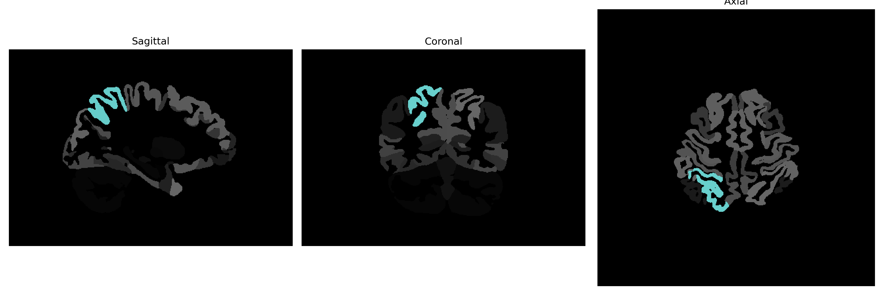

# superior-parietal-lobule

## Overview

The right superior parietal lobule, located in the parietal lobe of the brain, plays a crucial role in integrating sensory information and spatial awareness. It is involved in various cognitive tasks, including attention allocation, visuospatial processing, and coordinating movements in response to sensory input. This region helps the brain interpret tactile stimuli and is key in tasks requiring hand-eye coordination. Its connectivity with other regions allows for effective sensory integration, which is vital for navigation and understanding the spatial layout of one's environment.

There is no direct Wikipedia link for the right superior parietal lobule from the brainCOLOR Atlas. However, a related link is available for the parietal lobe: https://en.wikipedia.org/wiki/Parietal_lobe.

*Overview generated by GPT-4o (2026).*

---

**Region ID:** 112  
**Hemisphere:** Right  
**Atlas:** brainCOLOR 

---

## Full Brain – Black Background

**Full Quality Version:** [Download MP4](full_black.mp4)

---

## Full Brain – White Background

**Full Quality Version:** [Download MP4](full_white.mp4)

---

## Hemisphere Only – Black Background

**Full Quality Version:** [Download MP4](hemi_black.mp4)

---

## Hemisphere Only – White Background

**Full Quality Version:** [Download MP4](hemi_white.mp4)

---

## Triplanar View (Centered on ROI)

