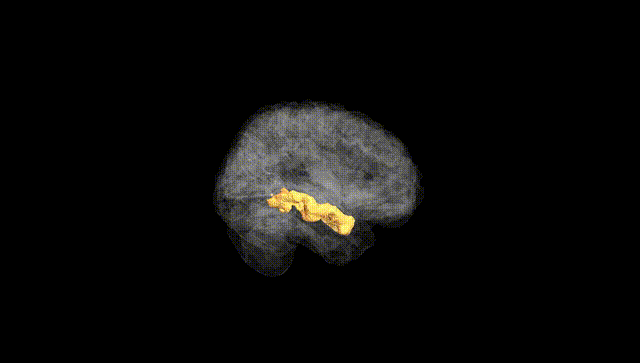
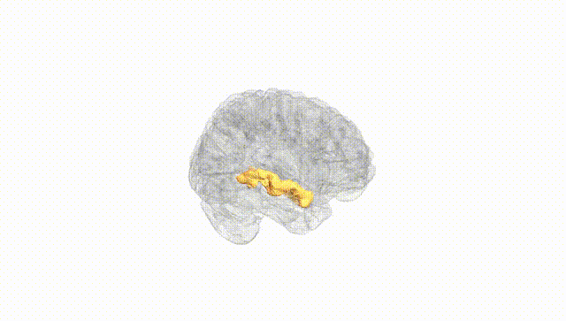
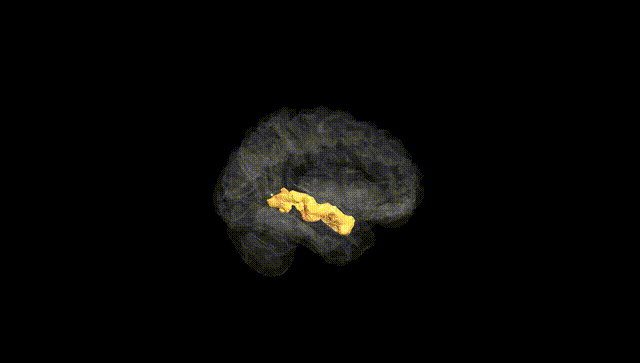
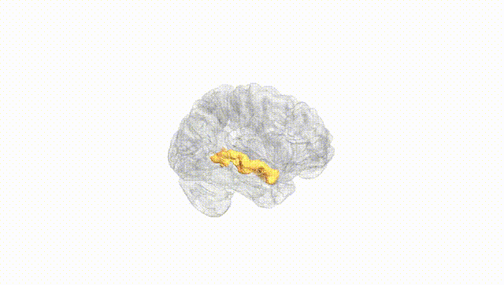
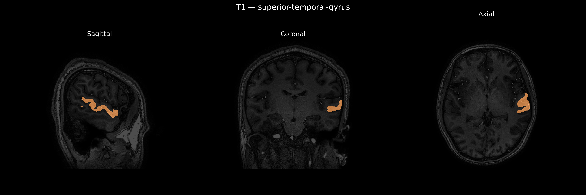
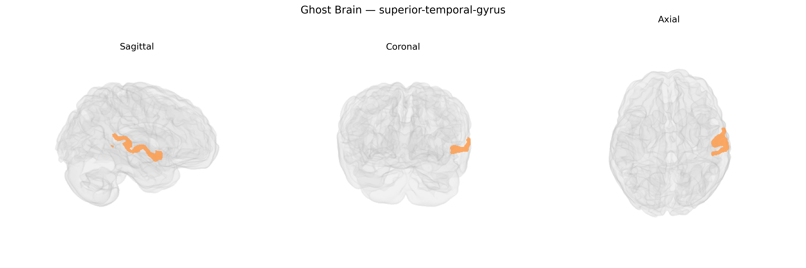

# superior-temporal-gyrus

## Overview

The left superior temporal gyrus is a cortical region of the temporal lobe located on the lateral surface of the brain, running parallel and inferior to the lateral (Sylvian) fissure and superior to the middle temporal gyrus. It encompasses primary and higher-order auditory cortices, including Heschl’s gyrus and portions of the planum temporale, and plays a central role in auditory perception, phonological processing, and language comprehension, particularly in the dominant (typically left) hemisphere. Cytoarchitectonically, it contains areas such as Brodmann areas 22, 41, and 42, which integrate acoustic features into meaningful linguistic representations and support interactions with frontal language areas via dorsal and ventral white-matter pathways. The brainCOLOR Atlas region “Left superior-temporal-gyrus” corresponds to this anatomical territory, delimited according to surface landmarks and sulcal boundaries for standardized neuroimaging parcellation. There is no direct Wikipedia page specifically for the “Left superior-temporal-gyrus” brainCOLOR region; a closely related page is: https://en.wikipedia.org/wiki/Superior_temporal_gyrus.

*Overview generated by GPT-4o (2026).*

---

**Region ID:** 115  
**Hemisphere:** Left  
**Atlas:** brainCOLOR 

---

## Full Brain – Black Background

**Full Quality Version:** [Download MP4](full_black.mp4)

---

## Full Brain – White Background

**Full Quality Version:** [Download MP4](full_white.mp4)

---

## Hemisphere Only – Black Background

**Full Quality Version:** [Download MP4](hemi_black.mp4)

---

## Hemisphere Only – White Background

**Full Quality Version:** [Download MP4](hemi_white.mp4)

---

## Triplanar View – T1 Background

---

## Triplanar View – Ghost Brain


