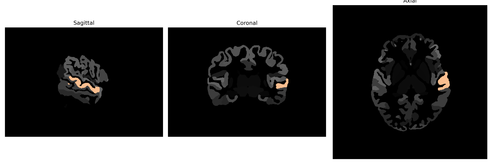

# superior-temporal-gyrus

## Overview

The Left superior-temporal-gyrus (STG) is a region located in the temporal lobe of the brain, playing a crucial role in processing auditory information and language comprehension. It encompasses significant structures such as Wernicke's area, which is involved in the comprehension of spoken and written language. The STG is also implicated in the perception of emotions in vocal tones, music processing, and the integration of sensory inputs. In addition to its primary auditory processing functions, the superior-temporal-gyrus contributes to complex cognitive processes including social cognition and memory retrieval. Its connectivity with other brain regions facilitates the integration of auditory and non-auditory stimuli, essential for effective communication and linguistic abilities.

There is no direct Wikipedia link for the description of the Left superior-temporal-gyrus from the brainCOLOR Atlas. Here is a related link to a more general description: https://en.wikipedia.org/wiki/Superior_temporal_gyrus

*Overview generated by GPT-4o (2026).*

---

**Region ID:** 115  
**Hemisphere:** Left  
**Atlas:** brainCOLOR 

---

## Full Brain – Black Background

**Full Quality Version:** [Download MP4](full_black.mp4)

---

## Full Brain – White Background

**Full Quality Version:** [Download MP4](full_white.mp4)

---

## Hemisphere Only – Black Background

**Full Quality Version:** [Download MP4](hemi_black.mp4)

---

## Hemisphere Only – White Background

**Full Quality Version:** [Download MP4](hemi_white.mp4)

---

## Triplanar View (Centered on ROI)

