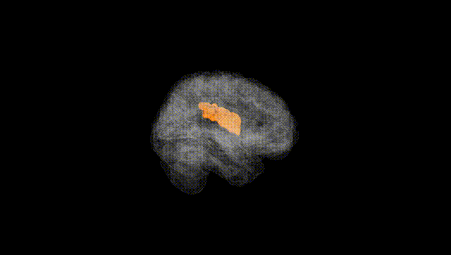
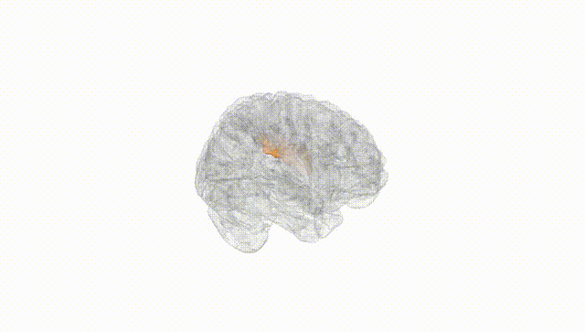
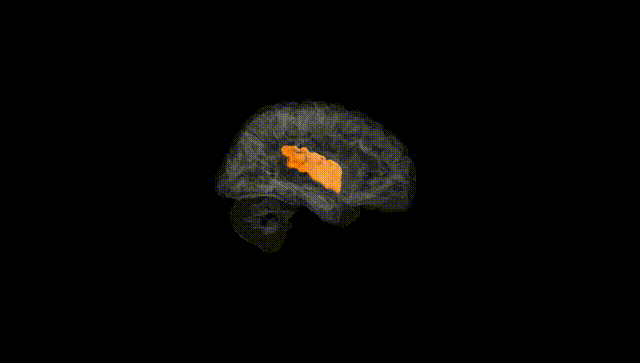
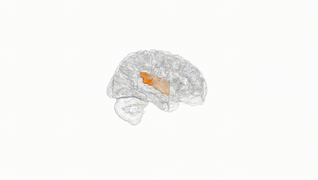
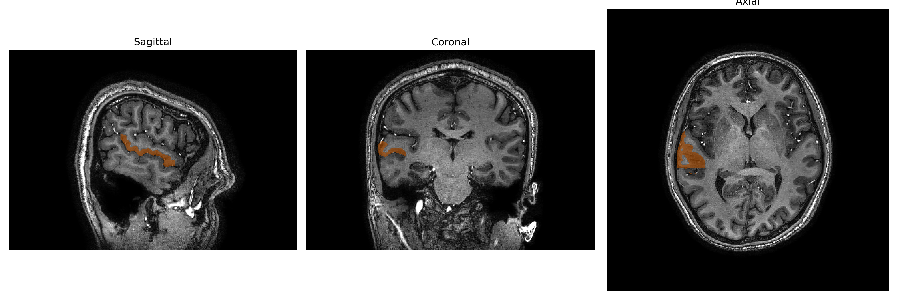
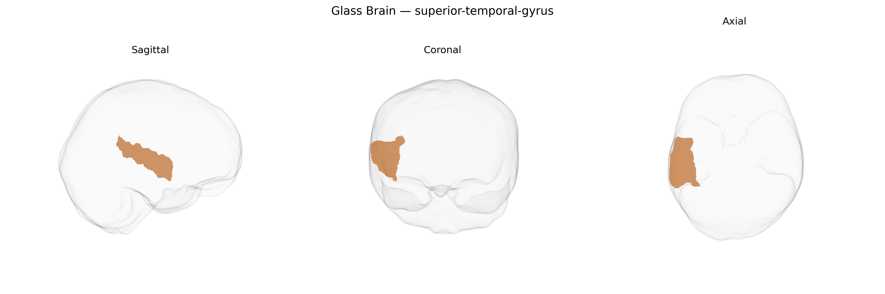

# superior-temporal-gyrus

## Overview

The right superior temporal gyrus (STG) is a neocortical region of the temporal lobe located on the lateral surface of the brain, extending from the temporal pole posteriorly toward the parietal lobe and bounded dorsally by the lateral (Sylvian) fissure. It contains auditory association cortex, including parts of the secondary auditory areas, and participates in higher-order auditory processing, prosody perception, aspects of social cognition, and integration of multimodal sensory information. The right STG is particularly implicated in processing nonverbal components of communication (such as intonation and emotional tone), in contrast to left-hemisphere specializations for language semantics and syntax. It is structurally interconnected with other temporal, parietal, and frontal regions, including networks involved in auditory perception, language, and social and emotional processing, and is a component of large-scale functional networks such as the default mode and salience-related systems.  

Wikipedia link (related structure, no brainCOLOR-specific page): https://en.wikipedia.org/wiki/Superior_temporal_gyrus

*Overview generated by GPT-4o (2026).*

---

**Region ID:** 114  
**Hemisphere:** Right  
**Atlas:** brainCOLOR 

---

## superior-temporal-gyrus – Black Background (Full Brain)

**Full Quality Version:** [Download MP4](full_black.mp4)

---

## superior-temporal-gyrus – White Background (Full Brain)

**Full Quality Version:** [Download MP4](full_white.mp4)

---

## superior-temporal-gyrus – Black Background (Hemisphere)

**Full Quality Version:** [Download MP4](hemi_black.mp4)

---

## superior-temporal-gyrus – White Background (Hemisphere)

**Full Quality Version:** [Download MP4](hemi_white.mp4)

---

## Triplanar View – T1 Background

---

## Triplanar View – Ghost Brain


