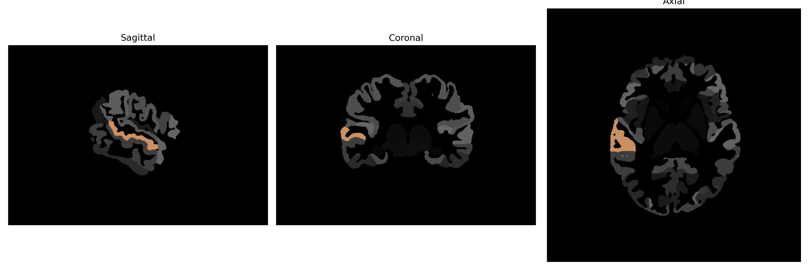

# superior-temporal-gyrus

## Overview

The Right Superior Temporal Gyrus (STG) is a prominent region in the brain located in the temporal lobe, playing an essential role in auditory processing and language comprehension. It forms a key part of the auditory cortex and is involved in the perceptual processing of sounds, including the analysis of verbal and non-verbal cues. This region also participates in higher-order cognitive functions, such as social cognition and the integration of multisensory information, which are crucial for effective communication and interaction. Functionally, the Right STG is connected to various other brain areas, helping modulate auditory attention and language semantics. Damage or dysfunction in this area can result in auditory agnosia or difficulties in understanding language. 

There is no direct Wikipedia link for the Right Superior Temporal Gyrus description from the brainCOLOR Atlas. However, a related entry can be found at: https://en.wikipedia.org/wiki/Superior_temporal_gyrus

*Overview generated by GPT-4o (2026).*

---

**Region ID:** 114  
**Hemisphere:** Right  
**Atlas:** brainCOLOR 

---

## Full Brain – Black Background

**Full Quality Version:** [Download MP4](full_black.mp4)

---

## Full Brain – White Background

**Full Quality Version:** [Download MP4](full_white.mp4)

---

## Hemisphere Only – Black Background

**Full Quality Version:** [Download MP4](hemi_black.mp4)

---

## Hemisphere Only – White Background

**Full Quality Version:** [Download MP4](hemi_white.mp4)

---

## Triplanar View (Centered on ROI)

