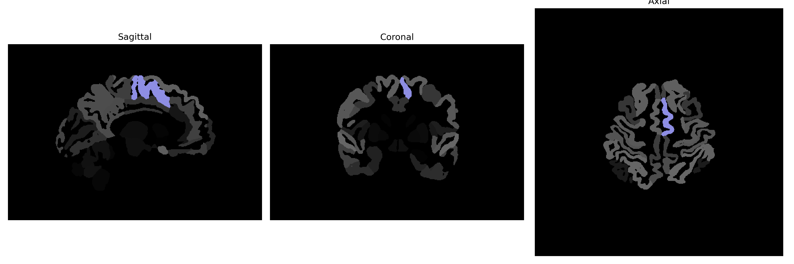

# supplementary-motor-cortex

## Overview

The Left Supplementary Motor Cortex (SMC) is located in the medial aspect of the frontal lobe, anterior to the primary motor cortex. This region plays a critical role in the planning and coordination of complex movements, especially those involving both sides of the body or sequences of actions. It is involved in motor preparation and is particularly active in tasks that require internally generated and sequential movements. It communicates with other motor areas, such as the primary motor cortex and prefrontal regions, to execute these complex motor actions. The left SMC is often studied in the context of language production and processing due to its proximity and connectivity to Broca’s area, which is located in the left hemisphere.

There is no direct link from Wikipedia specifically to the left supplementary-motor-cortex brain region as described by the brainCOLOR Atlas. However, more information can be found related to the broader supplementary motor area at: https://en.wikipedia.org/wiki/Supplementary_motor_area.

*Overview generated by GPT-4o (2026).*

---

**Region ID:** 107  
**Hemisphere:** Left  
**Atlas:** brainCOLOR 

---

## Full Brain – Black Background

**Full Quality Version:** [Download MP4](full_black.mp4)

---

## Full Brain – White Background

**Full Quality Version:** [Download MP4](full_white.mp4)

---

## Hemisphere Only – Black Background

**Full Quality Version:** [Download MP4](hemi_black.mp4)

---

## Hemisphere Only – White Background

**Full Quality Version:** [Download MP4](hemi_white.mp4)

---

## Triplanar View (Centered on ROI)

