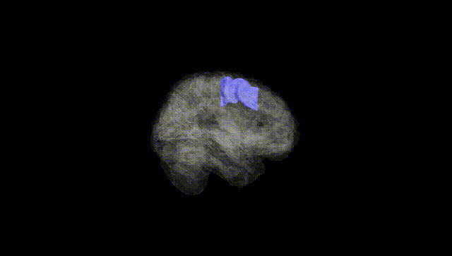
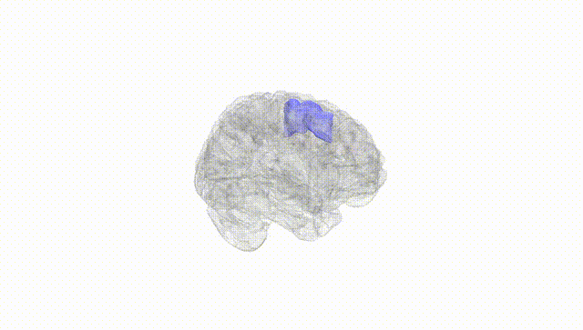
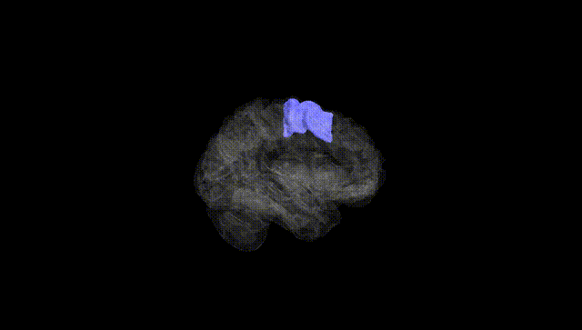
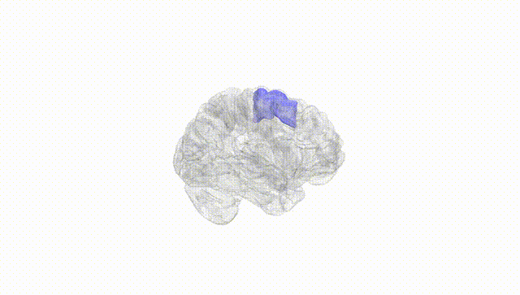
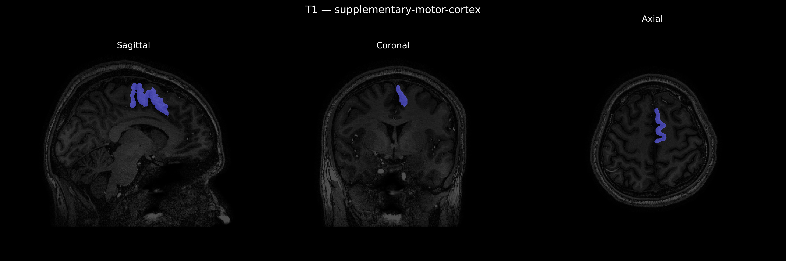
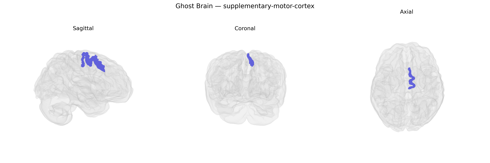

# supplementary-motor-cortex

## Overview

The left supplementary motor cortex (SMC), as defined in the brainCOLOR Atlas, is a medial frontal lobe region located on the dorsomedial surface of the hemisphere anterior to the primary motor cortex, largely occupying parts of the superior frontal gyrus and extending around the paracentral lobule. It is involved in higher-order aspects of motor control, including motor planning, initiation and sequencing of complex movements, coordination of bilateral actions, and internally generated (self-initiated) movements rather than those guided purely by external cues. The left SMC is particularly implicated in planning speech-related motor sequences and in integrating motor intentions with execution, and it maintains dense functional and structural connectivity with primary motor cortex, premotor areas, basal ganglia, and supplementary eye fields. There is no direct Wikipedia page specifically for the “Left supplementary-motor-cortex” parcel from the brainCOLOR Atlas; a closely related structure is described under the “Supplementary motor area” entry: https://en.wikipedia.org/wiki/Supplementary_motor_area

*Overview generated by GPT-4o (2026).*

---

**Region ID:** 107  
**Hemisphere:** Left  
**Atlas:** brainCOLOR 

---

## Full Brain – Black Background

**Full Quality Version:** [Download MP4](full_black.mp4)

---

## Full Brain – White Background

**Full Quality Version:** [Download MP4](full_white.mp4)

---

## Hemisphere Only – Black Background

**Full Quality Version:** [Download MP4](hemi_black.mp4)

---

## Hemisphere Only – White Background

**Full Quality Version:** [Download MP4](hemi_white.mp4)

---

## Triplanar View – T1 Background

---

## Triplanar View – Ghost Brain


