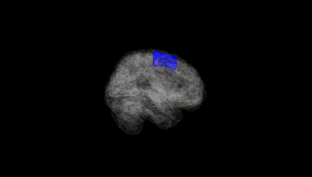
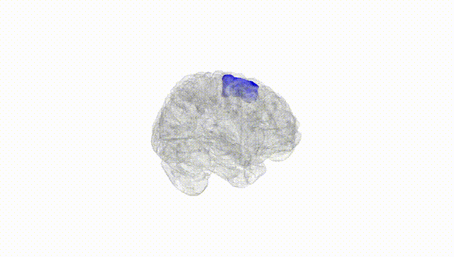
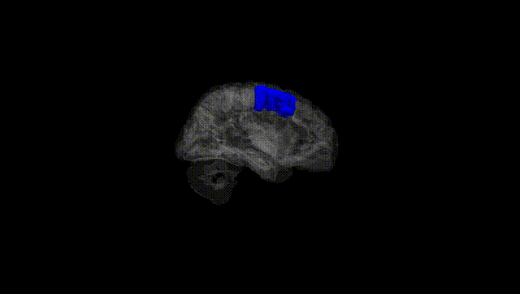
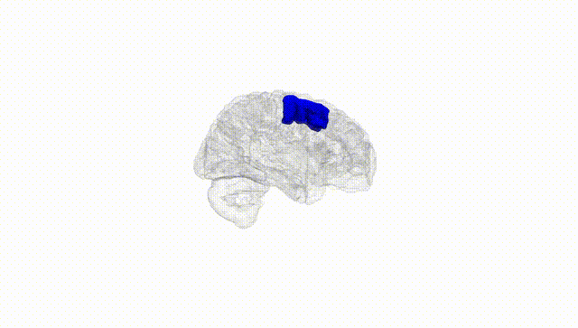
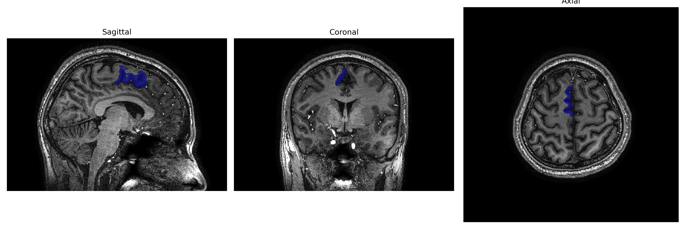
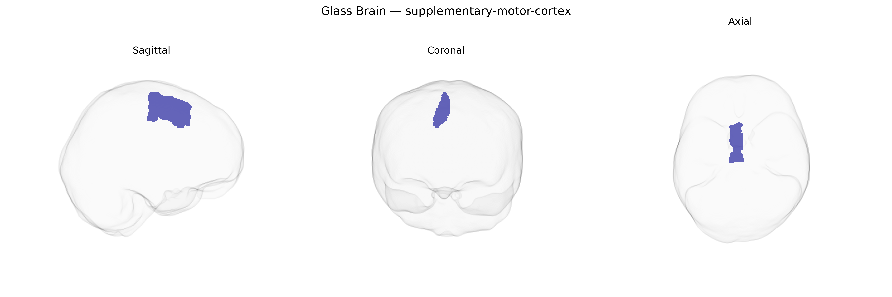

# supplementary-motor-cortex

## Overview

None

*Overview generated by GPT-4o (2026).*

---

**Region ID:** 106  
**Hemisphere:** Right  
**Atlas:** brainCOLOR 

---

## supplementary-motor-cortex – Black Background (Full Brain)

**Full Quality Version:** [Download MP4](full_black.mp4)

---

## supplementary-motor-cortex – White Background (Full Brain)

**Full Quality Version:** [Download MP4](full_white.mp4)

---

## supplementary-motor-cortex – Black Background (Hemisphere)

**Full Quality Version:** [Download MP4](hemi_black.mp4)

---

## supplementary-motor-cortex – White Background (Hemisphere)

**Full Quality Version:** [Download MP4](hemi_white.mp4)

---

## Triplanar View – T1 Background

---

## Triplanar View – Ghost Brain


