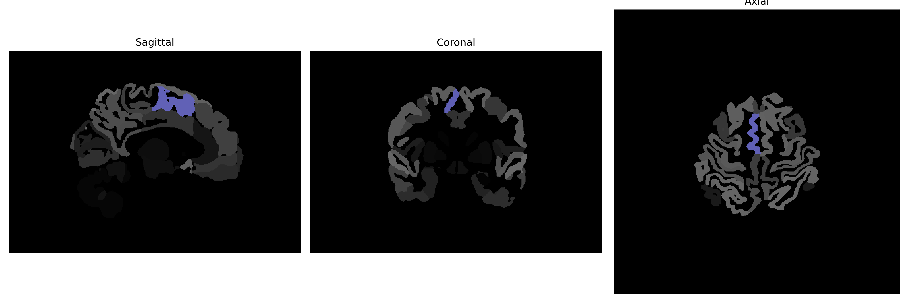

# supplementary-motor-cortex

## Overview

The Right Supplementary Motor Cortex (SMC) is a part of the brain involved in the planning and coordination of movement, located in the medial portion of the frontal lobe, anterior to the primary motor cortex. It plays a crucial role in the initiation of voluntary motor actions and is involved in the organization and sequencing of movements. The region is particularly important for tasks involving temporal coordination and complex, learned sequences of movements. Additionally, the SMC is connected with other motor and sensory regions, including the premotor cortex and the basal ganglia, which are important for motor control and learning.

There is no direct Wikipedia link for the Right Supplementary Motor Cortex. However, a related area, the supplementary motor area (SMA), can be accessed here: [Supplementary motor area - Wikipedia](https://en.wikipedia.org/wiki/Supplementary_motor_area).

*Overview generated by GPT-4o (2026).*

---

**Region ID:** 106  
**Hemisphere:** Right  
**Atlas:** brainCOLOR 

---

## Full Brain – Black Background

**Full Quality Version:** [Download MP4](full_black.mp4)

---

## Full Brain – White Background

**Full Quality Version:** [Download MP4](full_white.mp4)

---

## Hemisphere Only – Black Background

**Full Quality Version:** [Download MP4](hemi_black.mp4)

---

## Hemisphere Only – White Background

**Full Quality Version:** [Download MP4](hemi_white.mp4)

---

## Triplanar View (Centered on ROI)

