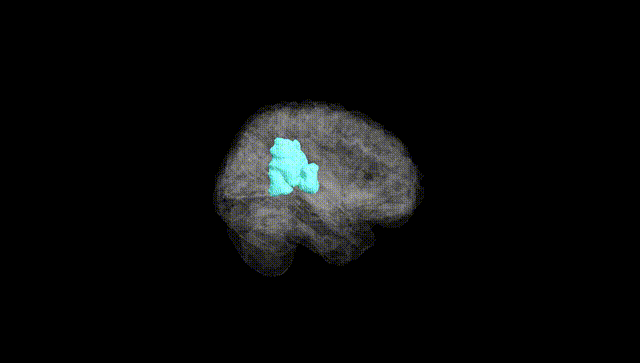
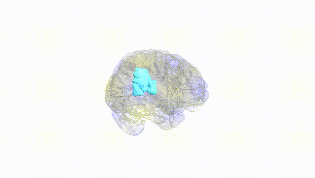
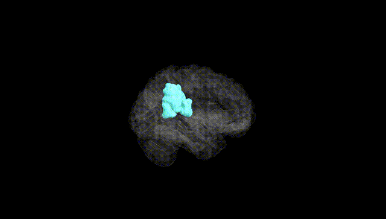
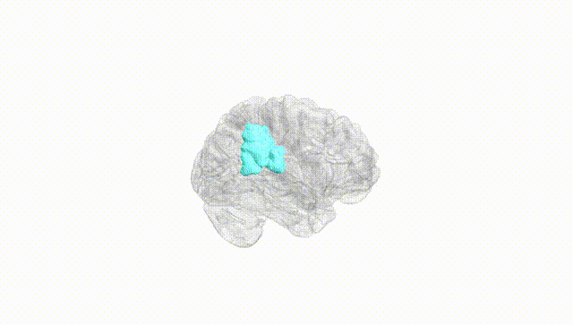
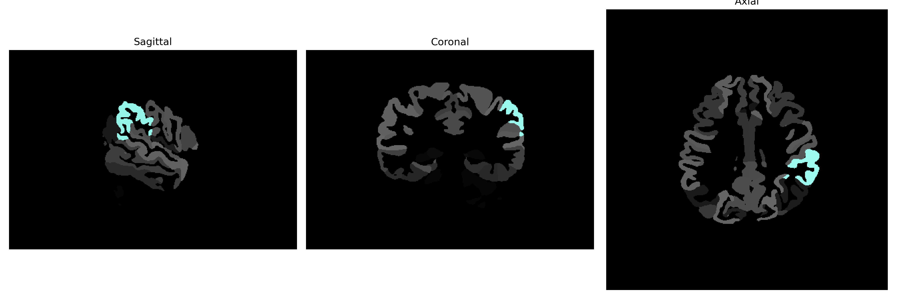

# supramarginal-gyrus

## Overview

The left supramarginal gyrus is a region of the human cerebral cortex located in the inferior parietal lobule, adjacent to the lateral sulcus. It plays a crucial role in language perception and processing, phonological working memory, and spatial attention. Functionally, it is involved in integrating sensory information from various modalities and is essential for language comprehension tasks such as reading and writing. It forms part of the parietal lobe's complex network that contributes to the understanding and organization of spoken and written language. The supramarginal gyrus interacts with other brain regions such as the angular gyrus and Wernicke's area to facilitate these functions. 

There is no direct Wikipedia link for the Left supramarginal gyrus specifically from the brainCOLOR Atlas. However, a related link about the supramarginal gyrus can be found here: https://en.wikipedia.org/wiki/Supramarginal_gyrus

*Overview generated by GPT-4o (2026).*

---

**Region ID:** 109  
**Hemisphere:** Left  
**Atlas:** brainCOLOR 

---

## Full Brain – Black Background

**Full Quality Version:** [Download MP4](full_black.mp4)

---

## Full Brain – White Background

**Full Quality Version:** [Download MP4](full_white.mp4)

---

## Hemisphere Only – Black Background

**Full Quality Version:** [Download MP4](hemi_black.mp4)

---

## Hemisphere Only – White Background

**Full Quality Version:** [Download MP4](hemi_white.mp4)

---

## Triplanar View (Centered on ROI)

