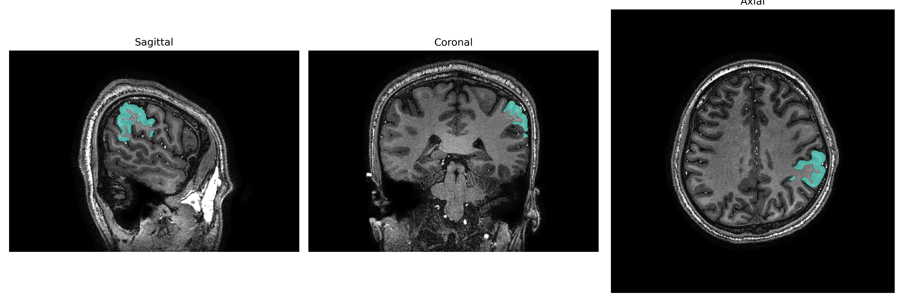
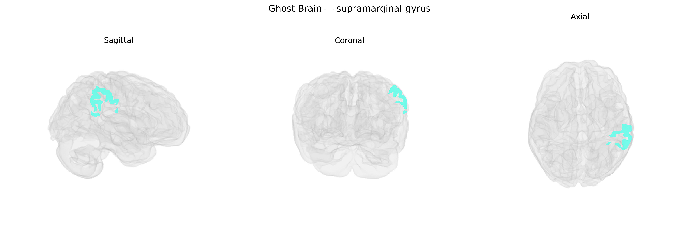

# supramarginal-gyrus
 
## Overview
 
The Left supramarginal gyrus is a parietal lobe structure forming part of the inferior parietal lobule, arching around the posterior end of the lateral (Sylvian) fissure. Cytoarchitectonically, it includes portions of Brodmann areas 40 and adjacent regions, receiving multimodal input from auditory, somatosensory, and visual association cortices. It plays a key role in phonological processing, speech perception, and aspects of language comprehension, particularly in mapping sounds to articulatory and orthographic representations; it is frequently implicated in reading and writing functions and in the dorsal language pathway. Functionally, it is also involved in spatial attention, sensorimotor integration, and aspects of social cognition such as empathy and perspective-taking. Lesions in this region can contribute to language deficits, including conduction aphasia and phonological dyslexia, as well as disturbances in body schema and spatial awareness. [Supramarginal gyrus](https://en.wikipedia.org/wiki/Supramarginal_gyrus)
 
Genetic associations involving the left supramarginal gyrus (SMG) in the brainCOLOR Atlas and related parcellations largely emerge from imaging-genetics and GWAS of brain structure, cognition, and neuropsychiatric traits. Variants near genes involved in cortical development and synaptic function—such as CDK5RAP2, KIBRA (WWC1), and microtubule/axon guidance genes—have been associated with regional cortical thickness or surface area measures encompassing the supramarginal gyrus in large consortia like ENIGMA and UK Biobank, although specific locus–region effects often span adjacent parietal areas. The left SMG is strongly implicated in language, phonological processing, reading, and working memory, and GWAS of reading ability/dyslexia and related language traits have identified risk variants in genes including DCDC2, KIAA0319, and FOXP2, which show expression in temporo-parietal regions that include the supramarginal gyrus, though spatially precise, atlas-specific genetic mapping remains incomplete. Neuropsychiatric GWAS (for schizophrenia, major depression, ADHD, and autism spectrum disorder) have linked polygenic risk scores to structural or functional alterations in the left SMG, with higher polygenic burden for schizophrenia and depression often related to reduced cortical thickness or altered activation in this region during language or social-cognition tasks. Additionally, genetic liability for Alzheimer’s disease and frontotemporal dementia has been associated with atrophy patterns that involve the supramarginal gyrus, particularly in carriers of APOE ε4 and mutations affecting tau and TDP-43 pathways, reflecting vulnerability of parietal association cortex in neurodegeneration. Overall, current evidence supports a polygenic architecture in which common variants influencing neurodevelopment, synaptic plasticity, and white-matter organization contribute to inter-individual differences in left supramarginal gyrus structure and function, which in turn are linked to language-related traits and risk for psychiatric and neurodegenerative disorders, but no single gene shows a region-exclusive, robust effect specific to the left SMG in the brainCOLOR Atlas.
 
*Overview generated by GPT-4o (2026).*
 
---
 
**Region ID:** 109  
**Hemisphere:** Left  
**Atlas:** brainCOLOR 
 
---
 
## supramarginal-gyrus – Black Background (Full Brain)
 

 
**Full Quality Version:** <a href="full_black.mp4" download>Download MP4</a>
 
---
 
## supramarginal-gyrus – White Background (Full Brain)
 

 
**Full Quality Version:** <a href="full_white.mp4" download>Download MP4</a>
 
---

## supramarginal-gyrus – Black Background (Hemisphere)
 

 
**Full Quality Version:** <a href="hemi_black.mp4" download>Download MP4</a>
 
---
 
## supramarginal-gyrus – White Background (Hemisphere)
 

 
**Full Quality Version:** <a href="hemi_white.mp4" download>Download MP4</a>
 
---

## Triplanar View – T1 Background
 

 
---
 
## Triplanar View – Ghost Brain
 


