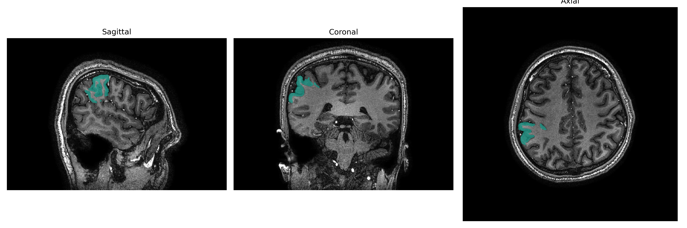
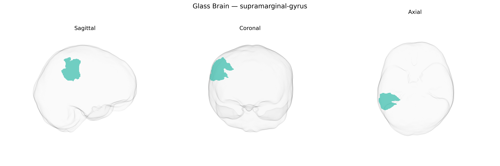

# supramarginal-gyrus
 
## Overview
 
The right supramarginal gyrus is a portion of the inferior parietal lobule located at the junction of the parietal, temporal, and frontal lobes, curving around the posterior end of the lateral (Sylvian) fissure. Cytoarchitectonically, it corresponds largely to Brodmann area 40 and is supplied predominantly by branches of the middle cerebral artery. This region is implicated in higher-order multimodal integration, including phonological processing, spatial attention, sensorimotor integration, and aspects of social cognition such as empathy and perspective taking. Functional imaging and lesion studies suggest that the right supramarginal gyrus plays a role in reorienting attention, body awareness, and distinguishing self-produced from externally produced actions, with dysfunction associated with neglect syndromes and disruptions in language and praxis networks. There is no direct link for the right supramarginal gyrus; see the related structure [Supramarginal gyrus](https://en.wikipedia.org/wiki/Supramarginal_gyrus).
 
Genetic associations involving the right supramarginal gyrus, as delineated in the brainCOLOR atlas and related parcellations, primarily emerge from imaging-genetics and GWAS of cortical morphology, language, social cognition, and psychiatric traits. GWAS of regional cortical thickness and surface area have implicated variants near genes involved in neurodevelopment and synaptic function (for example, loci near genes such as HMGA2, MIR137-related regions, and other neurodevelopmental genes) that influence supramarginal gyrus structure, though individual loci are often shared across neighboring temporoparietal regions rather than unique to this area. Functionally, the right supramarginal gyrus is frequently highlighted in genetic studies of language and reading, with overlap in risk loci for dyslexia and specific language impairment, as well as in polygenic risk associations for autism spectrum disorder, attention-deficit/hyperactivity disorder, and schizophrenia, where altered structure or connectivity of this region is reported. Large-scale consortia such as ENIGMA have also linked polygenic scores for educational attainment, intelligence, and cognitive performance to supramarginal gyrus measures, suggesting that common variation affecting cognitive traits partially acts through this temporoparietal hub. Across disorders, convergent evidence indicates that genetic liability for social cognition and empathy (including overlap with autism- and schizophrenia-related variants) is reflected in volumetric and functional differences in the right supramarginal gyrus, although single “region-specific” risk genes have not been robustly established and most findings reflect polygenic, distributed influences on temporoparietal association cortex.
 
*Overview generated by GPT-4o (2026).*
 
---
 
**Region ID:** 108  
**Hemisphere:** Right  
**Atlas:** brainCOLOR 
 
---
 
## supramarginal-gyrus – Black Background (Full Brain)
 

 
**Full Quality Version:** <a href="full_black.mp4" download>Download MP4</a>
 
---
 
## supramarginal-gyrus – White Background (Full Brain)
 

 
**Full Quality Version:** <a href="full_white.mp4" download>Download MP4</a>
 
---

## supramarginal-gyrus – Black Background (Hemisphere)
 

 
**Full Quality Version:** <a href="hemi_black.mp4" download>Download MP4</a>
 
---
 
## supramarginal-gyrus – White Background (Hemisphere)
 

 
**Full Quality Version:** <a href="hemi_white.mp4" download>Download MP4</a>
 
---

## Triplanar View – T1 Background
 

 
---
 
## Triplanar View – Ghost Brain
 


