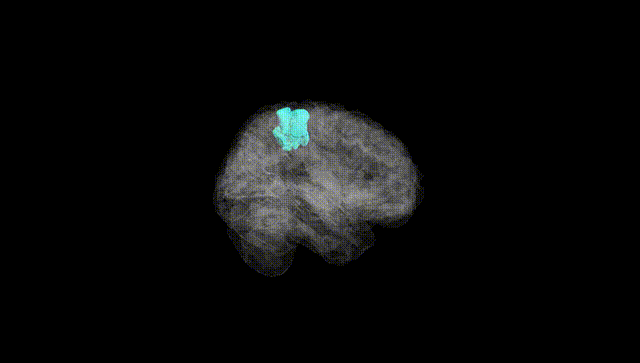
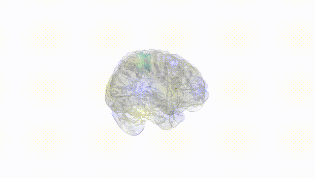
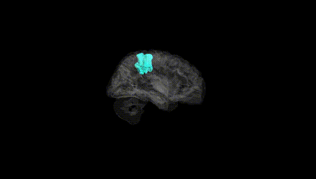
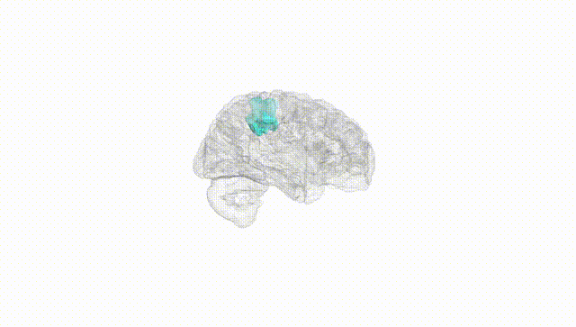
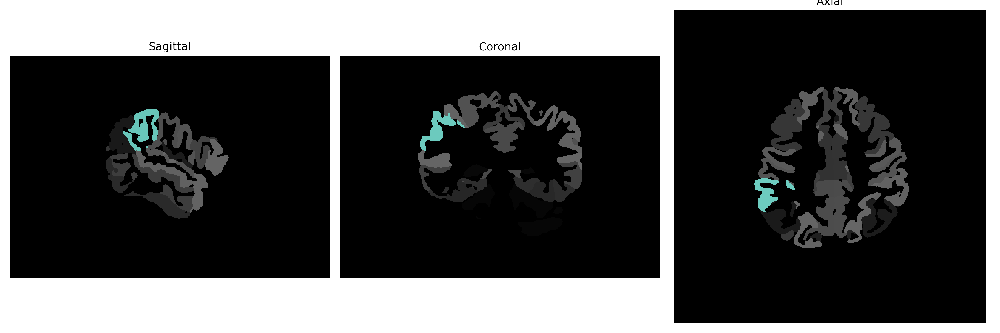

# supramarginal-gyrus

## Overview

The right supramarginal gyrus is a part of the parietal lobe located within the inferior parietal lobule, found near the lateral surface of the cerebral hemisphere. It wraps around the posterior end of the lateral sulcus and is involved in a range of functions including language processing, spatial and visuomotor tasks, and empathy. The supramarginal gyrus plays a significant role in integrating sensory information, and is also implicated in the phonological aspect of language, contributing to processes like understanding and producing speech.

There is no direct Wikipedia link to the specific description of the right supramarginal gyrus, but one related to its broader anatomical context is the parietal lobe: https://en.wikipedia.org/wiki/Parietal_lobe.

*Overview generated by GPT-4o (2026).*

---

**Region ID:** 108  
**Hemisphere:** Right  
**Atlas:** brainCOLOR 

---

## Full Brain – Black Background

**Full Quality Version:** [Download MP4](full_black.mp4)

---

## Full Brain – White Background

**Full Quality Version:** [Download MP4](full_white.mp4)

---

## Hemisphere Only – Black Background

**Full Quality Version:** [Download MP4](hemi_black.mp4)

---

## Hemisphere Only – White Background

**Full Quality Version:** [Download MP4](hemi_white.mp4)

---

## Triplanar View (Centered on ROI)

