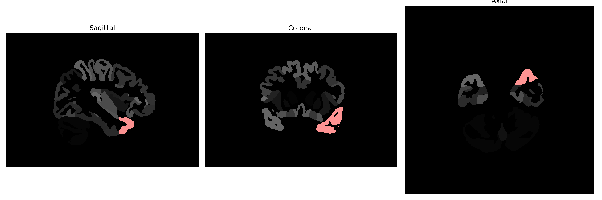

# temporal-pole

## Overview

The left temporal-pole brain region, often referred to as the temporal pole, is located at the anterior-most part of the temporal lobe. It plays a crucial role in high-level visual processing, semantic memory, and social-emotional processing, serving as a convergence zone for sensory inputs and complex cognitive functions. The region is interconnected with multiple cortical and subcortical areas, including the amygdala, prefrontal cortex, and limbic system, facilitating its role in processing emotional and social cues. Damage or dysfunction in the temporal pole can lead to deficits in understanding social contexts, emotional regulation, and memory functions. The left temporal pole is of particular interest due to its involvement in language and semantic processing.

There is no direct link to a description of the left temporal-pole brain region specifically from the brainCOLOR Atlas on Wikipedia. However, a related area is discussed here: [Temporal Lobe on Wikipedia](https://en.wikipedia.org/wiki/Temporal_lobe).

*Overview generated by GPT-4o (2026).*

---

**Region ID:** 117  
**Hemisphere:** Left  
**Atlas:** brainCOLOR 

---

## Full Brain – Black Background

**Full Quality Version:** [Download MP4](full_black.mp4)

---

## Full Brain – White Background

**Full Quality Version:** [Download MP4](full_white.mp4)

---

## Hemisphere Only – Black Background

**Full Quality Version:** [Download MP4](hemi_black.mp4)

---

## Hemisphere Only – White Background

**Full Quality Version:** [Download MP4](hemi_white.mp4)

---

## Triplanar View (Centered on ROI)

