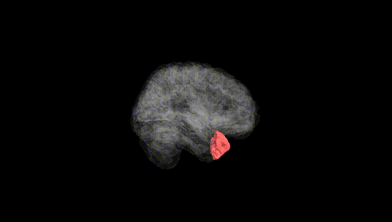
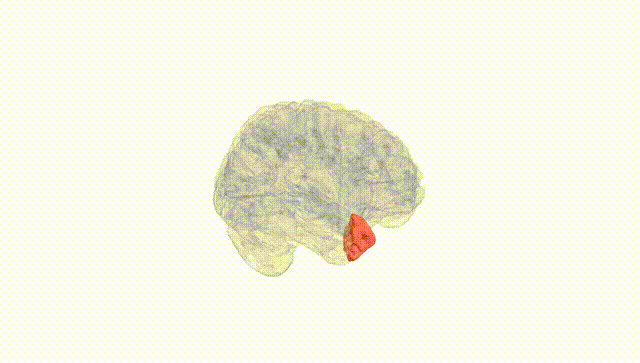
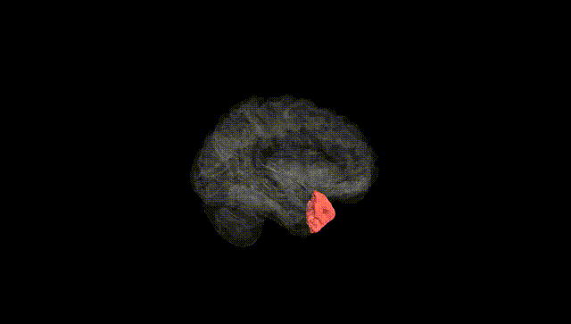
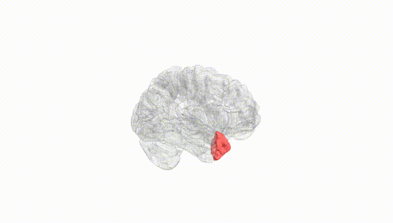
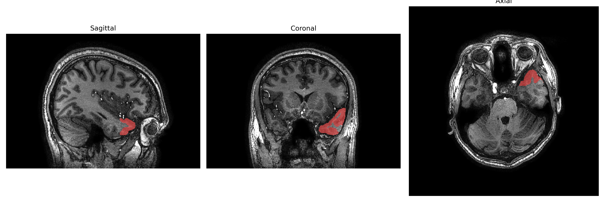
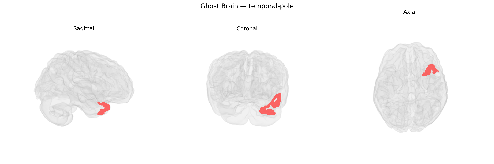

# temporal-pole
 
## Overview
 
The left temporal pole, corresponding broadly to the rostral portion of the left temporal lobe (Brodmann area 38), is a multimodal association region situated at the anterior-most end of the temporal lobe, adjacent to the temporal stem and overlying the anterior portion of the superior and middle temporal gyri. It receives convergent input from auditory, visual, and limbic structures and is implicated in semantic memory, social and emotional processing, and high-level language functions, including naming and comprehension of word meaning. The left temporal pole has dense connections with the amygdala, orbitofrontal cortex, and other temporal association areas, and is often involved in temporal lobe epilepsy and neurodegenerative disorders such as semantic variant primary progressive aphasia. There is no direct link specifically for the “left temporal pole”; a related structure is the [Temporal pole](https://en.wikipedia.org/wiki/Temporal_pole).
 
The left temporal pole, as defined in the brainCOLOR atlas, has been implicated in several genetic and GWAS-based associations, largely through studies of temporal-lobe structure, language, and socio-emotional processing. Twin and SNP-based heritability analyses show that cortical thickness and surface area in anterior temporal regions, including the temporal pole, are moderately to highly heritable, with contributions from common variants in genes implicated in neurodevelopment and synaptic function (e.g., genes involved in axon guidance, neuronal migration, and glutamatergic signaling). Large-scale GWAS of regional cortical morphology (such as ENIGMA and UK Biobank analyses) have identified loci near genes including KCNK2, FOXO3, and others associated with temporal cortical thickness or surface area, though these signals are often shared across nearby temporal regions and not always specific to the left temporal pole label. Genetic risk for Alzheimer’s disease (e.g., APOE) and frontotemporal dementia has been associated with atrophy patterns encompassing the anterior temporal lobes, and left temporal-pole structural or functional alterations are frequently seen in carriers of mutations in MAPT, GRN, and C9orf72 in frontotemporal lobar degeneration, as well as in temporal-variant semantic dementia. Polygenic scores for schizophrenia, autism spectrum disorder, and major depression show associations with temporal-lobe structural variation, including anterior temporal regions involved in social cognition and language, although the spatial specificity to the left temporal pole is generally coarse. Overall, existing genetic evidence supports a heritable contribution to left temporal-pole anatomy and vulnerability to neurodegenerative and psychiatric disorders, but most findings come from broader anterior temporal or temporal-lobe ROIs rather than from GWAS explicitly targeting the left temporal pole as a unique region in the brainCOLOR atlas.
 
*Overview generated by GPT-4o (2026).*
 
---
 
**Region ID:** 117  
**Hemisphere:** Left  
**Atlas:** brainCOLOR 
 
---
 
## temporal-pole – Black Background (Full Brain)
 

 
**Full Quality Version:** <a href="full_black.mp4" download>Download MP4</a>
 
---
 
## temporal-pole – White Background (Full Brain)
 

 
**Full Quality Version:** <a href="full_white.mp4" download>Download MP4</a>
 
---

## temporal-pole – Black Background (Hemisphere)
 

 
**Full Quality Version:** <a href="hemi_black.mp4" download>Download MP4</a>
 
---
 
## temporal-pole – White Background (Hemisphere)
 

 
**Full Quality Version:** <a href="hemi_white.mp4" download>Download MP4</a>
 
---

## Triplanar View – T1 Background
 

 
---
 
## Triplanar View – Ghost Brain
 


