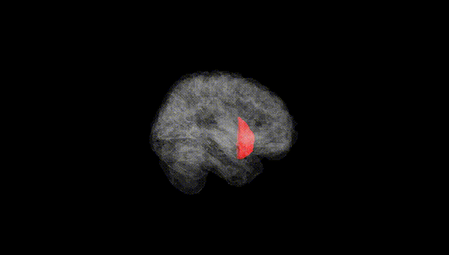
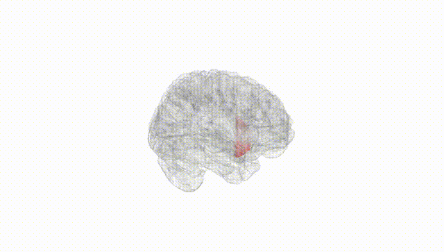
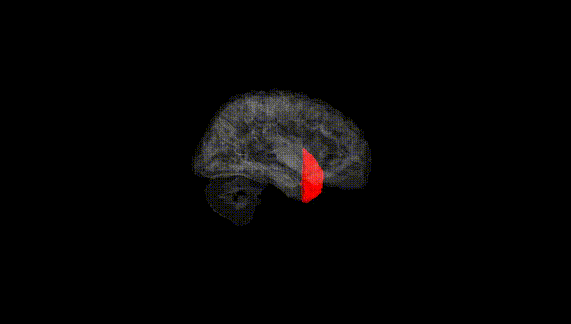
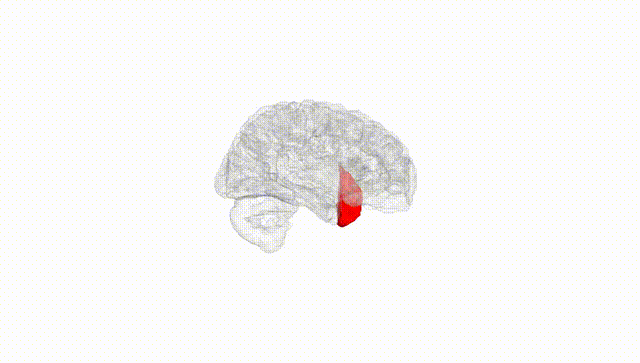
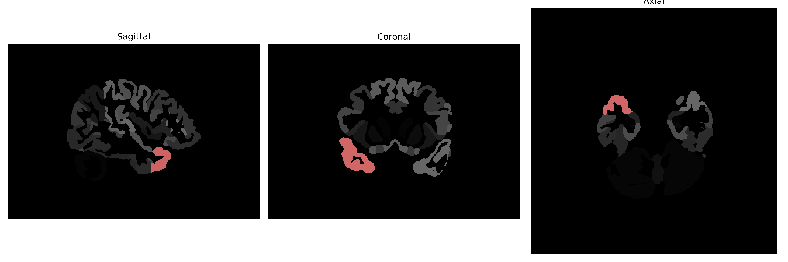

# temporal-pole

## Overview

The right temporal pole is a part of the temporal lobe in the human brain, situated at its most anterior end. This region is involved in high-level auditory processing, socioemotional cognition, and semantic memory processing. It plays a crucial role in understanding social and emotional cues within auditory stimuli, and it is involved in the representation of complex concepts and personal relevance. The right temporal pole is connected to multiple other brain regions, allowing it to integrate sensory information with emotional and conceptual context. The brainCOLOR Atlas provides detailed insights into this region, emphasizing its connectivity and functional implications in cognitive and emotional processing.

There is no direct Wikipedia link to the right temporal-pole brain region as described in the brainCOLOR Atlas. For a related area, you can refer to the Wikipedia page on the Temporal Lobe:

[Temporal Lobe - Wikipedia](https://en.wikipedia.org/wiki/Temporal_lobe)

*Overview generated by GPT-4o (2026).*

---

**Region ID:** 116  
**Hemisphere:** Right  
**Atlas:** brainCOLOR 

---

## Full Brain – Black Background

**Full Quality Version:** [Download MP4](full_black.mp4)

---

## Full Brain – White Background

**Full Quality Version:** [Download MP4](full_white.mp4)

---

## Hemisphere Only – Black Background

**Full Quality Version:** [Download MP4](hemi_black.mp4)

---

## Hemisphere Only – White Background

**Full Quality Version:** [Download MP4](hemi_white.mp4)

---

## Triplanar View (Centered on ROI)

