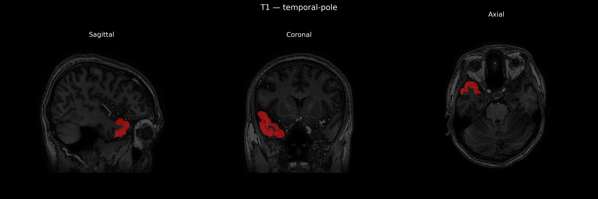
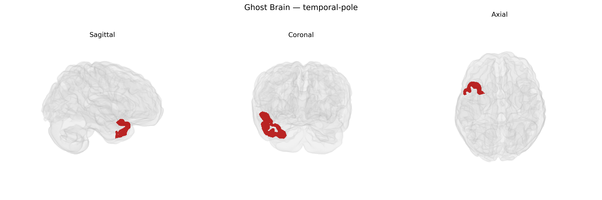

# temporal-pole

## Overview

The right temporal pole is the most anterior portion of the right temporal lobe, corresponding primarily to Brodmann area 38, and is composed of paralimbic cortex with extensive connections to limbic, frontal, and multimodal association regions. Cytoarchitectonically, it exhibits a transition between neocortical temporal areas and allocortical structures of the medial temporal lobe, with relatively thin cortex and dense reciprocal connectivity to the amygdala, orbitofrontal cortex, anterior cingulate cortex, and superior temporal gyrus. Functionally, the right temporal pole is implicated in social and emotional processing, semantic memory for person-related and autobiographical information, and integration of complex, multimodal sensory inputs into higher-order representations. It is particularly vulnerable in neurodegenerative conditions such as semantic variant primary progressive aphasia and frontotemporal dementia, where atrophy of the anterior temporal lobes, including the temporal pole, correlates with profound semantic and socioemotional deficits.

There is no direct Wikipedia page specifically for the “right temporal pole” as defined in the brainCOLOR Atlas; a closely related and encompassing structure is the temporal pole: https://en.wikipedia.org/wiki/Temporal_pole

*Overview generated by GPT-4o (2026).*

---

**Region ID:** 116  
**Hemisphere:** Right  
**Atlas:** brainCOLOR 

---

## Full Brain – Black Background

**Full Quality Version:** [Download MP4](full_black.mp4)

---

## Full Brain – White Background

**Full Quality Version:** [Download MP4](full_white.mp4)

---

## Hemisphere Only – Black Background

**Full Quality Version:** [Download MP4](hemi_black.mp4)

---

## Hemisphere Only – White Background

**Full Quality Version:** [Download MP4](hemi_white.mp4)

---

## Triplanar View – T1 Background

---

## Triplanar View – Ghost Brain


