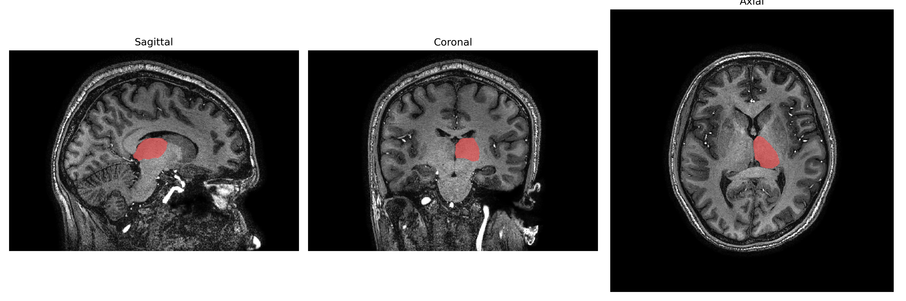
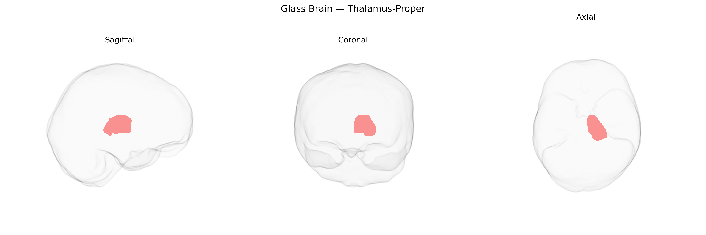

# Thalamus-Proper

## Overview

The Left Thalamus-Proper corresponds to the collection of thalamic nuclei in the left hemisphere that serve as a major relay and integration hub for sensory, motor, and associative information between subcortical structures and the cerebral cortex. It is composed of multiple functionally distinct nuclei that process inputs from modalities such as somatosensation, vision, and audition (excluding olfaction) and relay them to specific cortical regions, while also participating in motor circuitry via connections with the basal ganglia and cerebellum. In addition to its relay role, the left thalamus contributes to higher-order functions including attention, arousal, and aspects of cognition and language lateralized to the left hemisphere. Damage to this region can produce contralateral sensory deficits, motor disturbances, and cognitive or language impairments depending on the nuclei involved. There is no direct Wikipedia page for “Left Thalamus-Proper” as defined in the brainCOLOR atlas; a closely related structure and description can be found at: https://en.wikipedia.org/wiki/Thalamus

*Overview generated by GPT-4o (2026).*

---

**Region ID:** 16  
**Hemisphere:** Left  
**Atlas:** brainCOLOR 

---

## Thalamus-Proper – Black Background (Full Brain)

**Full Quality Version:** [Download MP4](full_black.mp4)

---

## Thalamus-Proper – White Background (Full Brain)

**Full Quality Version:** [Download MP4](full_white.mp4)

---

## Thalamus-Proper – Black Background (Hemisphere)

**Full Quality Version:** [Download MP4](hemi_black.mp4)

---

## Thalamus-Proper – White Background (Hemisphere)

**Full Quality Version:** [Download MP4](hemi_white.mp4)

---

## Triplanar View – T1 Background

---

## Triplanar View – Ghost Brain


