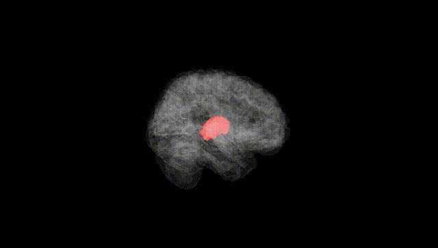
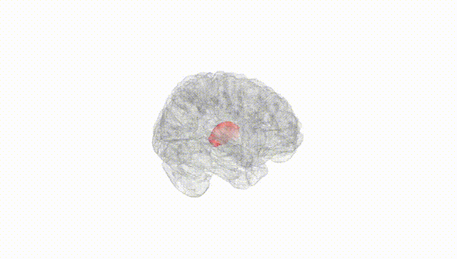
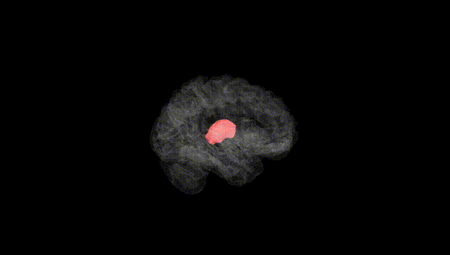
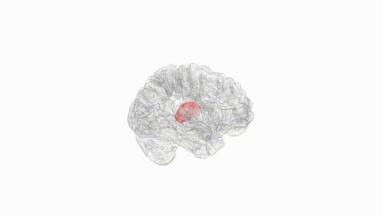
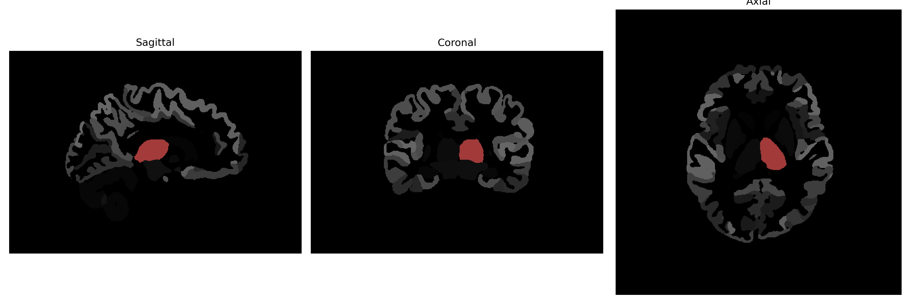

# Thalamus-Proper

## Overview

The Left Thalamus-Proper is a highly integrated neuronal structure situated deep within the cerebral hemispheres of the brain, serving as a vital relay and processing center for sensory and motor information. Its role encompasses the regulation and transmission of sensory signals to the corresponding regions in the cortex, facilitating conscious perception, and contributing to motor functions and the coordination of movements. Additionally, it plays a key role in modulating sleep-wake cycles, alertness, and attentional faculties. The Left Thalamus-Proper is part of the larger thalamic complex, which is symmetrically paired on either side of the third ventricle and enveloped by the cerebral cortex.

There is no direct Wikipedia link to the Left Thalamus-Proper description from the brainCOLOR Atlas. However, more information on the thalamus in general can be found at: https://en.wikipedia.org/wiki/Thalamus.

*Overview generated by GPT-4o (2026).*

---

**Region ID:** 16  
**Hemisphere:** Left  
**Atlas:** brainCOLOR 

---

## Full Brain – Black Background

**Full Quality Version:** [Download MP4](full_black.mp4)

---

## Full Brain – White Background

**Full Quality Version:** [Download MP4](full_white.mp4)

---

## Hemisphere Only – Black Background

**Full Quality Version:** [Download MP4](hemi_black.mp4)

---

## Hemisphere Only – White Background

**Full Quality Version:** [Download MP4](hemi_white.mp4)

---

## Triplanar View (Centered on ROI)

