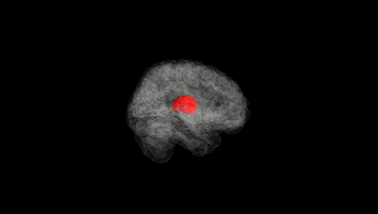
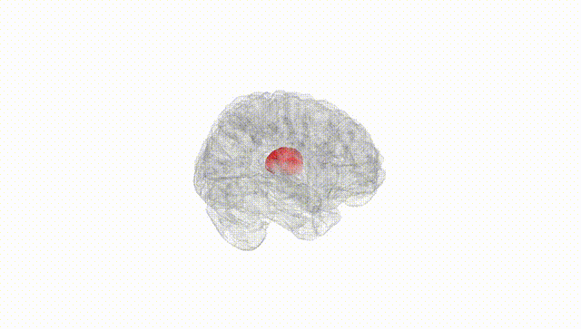
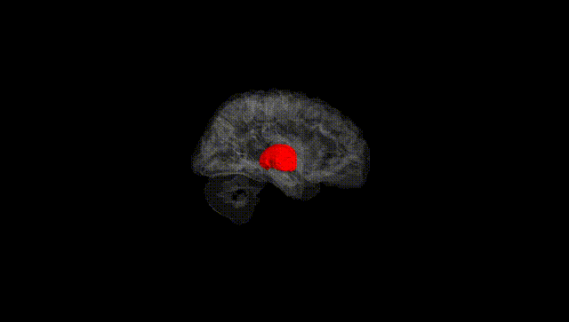
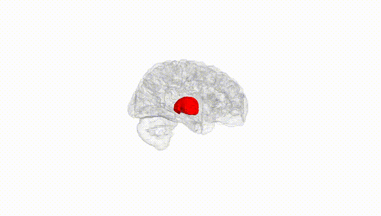
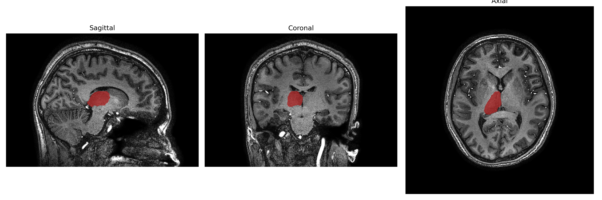
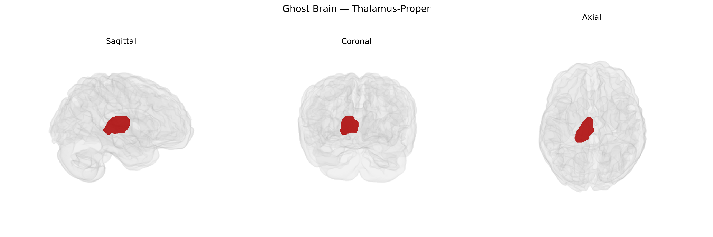

# Thalamus-Proper
 
## Overview
 
The Right Thalamus-Proper, as defined in the brainCOLOR Atlas, comprises the main nuclear mass of the thalamus in the right hemisphere, excluding epithalamic and subthalamic structures. It serves as a key relay and integrative hub for sensory (except olfactory), motor, and higher-order associative information, receiving input from peripheral sensory pathways, cerebellum, and basal ganglia, and projecting extensively to ipsilateral cortical regions, particularly in the frontal, parietal, and temporal lobes. Functionally, it participates in sensorimotor processing, attention, arousal regulation, and aspects of cognition and consciousness by modulating thalamocortical and corticothalamic circuits. The “proper” designation emphasizes inclusion of the principal relay and association nuclei (e.g., ventral posterior, ventral lateral, mediodorsal complexes) while excluding adjacent diencephalic regions that are anatomically and functionally distinct. [Thalamus](https://en.wikipedia.org/wiki/Thalamus)
 
The Right Thalamus-Proper, as defined in the brainCOLOR Atlas and comparable subcortical parcellations (e.g., FreeSurfer), shows modest but replicable heritability and polygenic influences in large-scale imaging-genetics studies. GWAS of thalamic volume and shape (notably ENIGMA and UK Biobank–based analyses) have identified multiple common variants associated with right thalamic structure, including loci near or within genes involved in neurodevelopment, synaptic signaling, and axon guidance (such as variants in or near genes like BAIAP2, SLC39A8, and others depending on the specific study and parcellation), although effects are typically small and highly polygenic. Genetic correlations link right thalamic volume with cognitive performance, intracranial volume, and general brain size, and several psychiatric and neurological disorders show both structural alterations and partial genetic overlap with this region. In particular, schizophrenia, bipolar disorder, major depressive disorder, ADHD, and autism spectrum disorder have been associated with altered thalamic volumes or connectivity, and cross-trait genetic analyses (e.g., LD score regression and polygenic risk score studies) indicate that some of the genetic architecture influencing right thalamic morphology overlaps with risk alleles for these conditions. Additionally, thalamic metrics show genetic correlations with traits such as intelligence, educational attainment, sleep phenotypes, and certain substance use and metabolic traits, suggesting that variants impacting right thalamic structure participate in broader neurodevelopmental and neuropsychiatric pathways rather than being specific to a single disorder.
 
*Overview generated by GPT-4o (2026).*
 
---
 
**Region ID:** 15  
**Hemisphere:** Right  
**Atlas:** brainCOLOR 
 
---
 
## Thalamus-Proper – Black Background (Full Brain)
 

 
**Full Quality Version:** <a href="full_black.mp4" download>Download MP4</a>
 
---
 
## Thalamus-Proper – White Background (Full Brain)
 

 
**Full Quality Version:** <a href="full_white.mp4" download>Download MP4</a>
 
---

## Thalamus-Proper – Black Background (Hemisphere)
 

 
**Full Quality Version:** <a href="hemi_black.mp4" download>Download MP4</a>
 
---
 
## Thalamus-Proper – White Background (Hemisphere)
 

 
**Full Quality Version:** <a href="hemi_white.mp4" download>Download MP4</a>
 
---

## Triplanar View – T1 Background
 

 
---
 
## Triplanar View – Ghost Brain
 


