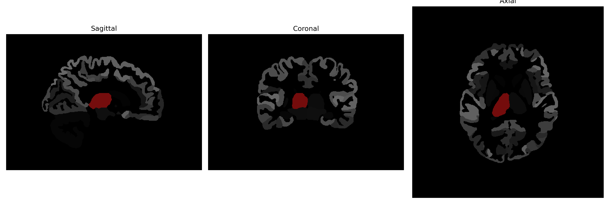

# Thalamus-Proper

## Overview

The Right Thalamus-Proper is a portion of the thalamus that is significant in relaying motor and sensory signals to the cerebral cortex. It is a critical structure within the diencephalon, performing integrative roles and participating in the regulation of consciousness, sleep, and alertness. As part of the thalamus, it connects to various cortices and is essential for the processing and transmission of information related to sensation and motor output. It plays a role in various cognitive functions, acting as a hub by filtering and directing information between different brain regions.

There is no direct Wikipedia link for "Right Thalamus-Proper" from the brainCOLOR Atlas. However, further information about the thalamus can be found here: https://en.wikipedia.org/wiki/Thalamus

*Overview generated by GPT-4o (2026).*

---

**Region ID:** 15  
**Hemisphere:** Right  
**Atlas:** brainCOLOR 

---

## Full Brain – Black Background

**Full Quality Version:** [Download MP4](full_black.mp4)

---

## Full Brain – White Background

**Full Quality Version:** [Download MP4](full_white.mp4)

---

## Hemisphere Only – Black Background

**Full Quality Version:** [Download MP4](hemi_black.mp4)

---

## Hemisphere Only – White Background

**Full Quality Version:** [Download MP4](hemi_white.mp4)

---

## Triplanar View (Centered on ROI)

