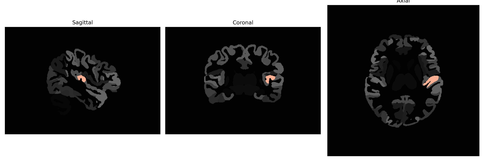

# transverse-temporal-gyrus

## Overview

The Left Transverse Temporal Gyrus, also known as Heschl’s Gyrus, is a critical structure located in the superior temporal plane of the brain. It is primarily involved in auditory processing and is considered the cortical region where sound is first analyzed by the brain. Anatomically, it is situated within the temporal lobe and extends transversely across the insular cortex, often buried within the Sylvian fissure. This gyrus is significant in the processing of auditory signals and is crucial for the perception of sound and language comprehension. Its roles in auditory sensory gating and in the early stages of sound processing make it a vital area for auditory-related functions and have implications in disorders like auditory processing disorder and language-related challenges.

There is no direct Wikipedia link specifically for the Left Transverse Temporal Gyrus from the brainCOLOR Atlas. However, a related entry can be found under "Heschl's gyrus," which discusses the broader functions and significance of this area: https://en.wikipedia.org/wiki/Heschl%27s_gyrus.

*Overview generated by GPT-4o (2026).*

---

**Region ID:** 121  
**Hemisphere:** Left  
**Atlas:** brainCOLOR 

---

## Full Brain – Black Background

**Full Quality Version:** [Download MP4](full_black.mp4)

---

## Full Brain – White Background

**Full Quality Version:** [Download MP4](full_white.mp4)

---

## Hemisphere Only – Black Background

**Full Quality Version:** [Download MP4](hemi_black.mp4)

---

## Hemisphere Only – White Background

**Full Quality Version:** [Download MP4](hemi_white.mp4)

---

## Triplanar View (Centered on ROI)

