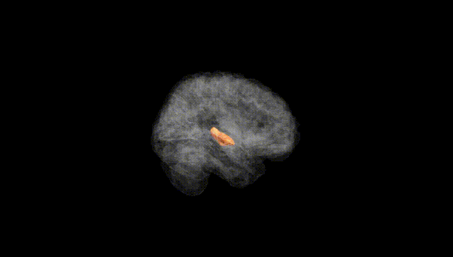
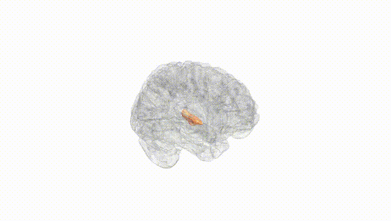
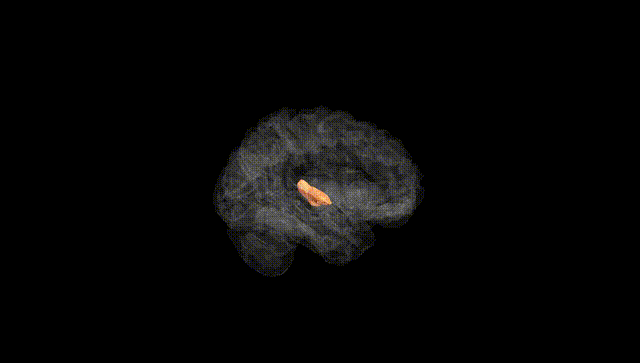
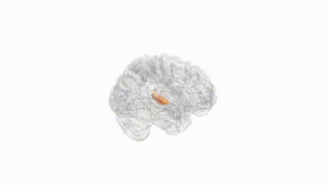
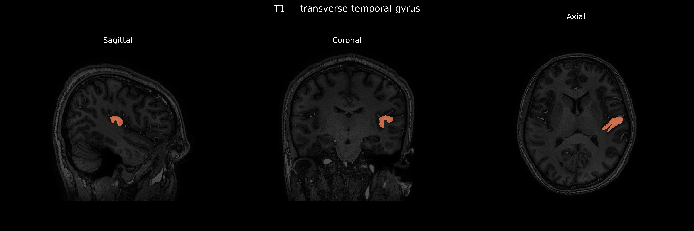
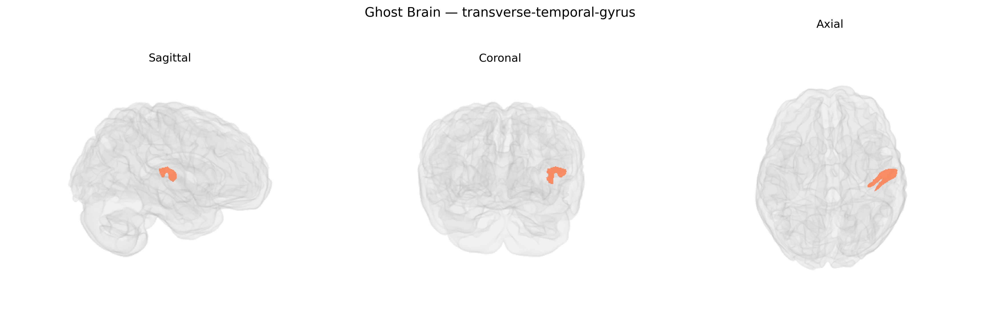

# transverse-temporal-gyrus

## Overview

The left transverse temporal gyrus (Heschl’s gyrus) is a cortical structure located on the superior surface of the temporal lobe, buried within the lateral (Sylvian) fissure, and constitutes the primary auditory cortex (Brodmann areas 41 and parts of 42). It runs obliquely and medially from the lateral surface of the temporal lobe toward the insula, forming the first transverse convolution on the superior temporal plane. Cytoarchitectonically, it is characterized by a koniocortical organization with a dense granular layer IV, adapted for processing high-fidelity auditory input from the medial geniculate nucleus of the thalamus. Functionally, the left transverse temporal gyrus is critically involved in the initial cortical processing of sound frequency, intensity, and temporal features, and in the dominant (usually left) hemisphere contributes to phonemic and speech perception. It is part of the broader auditory network that includes the superior temporal gyrus, planum temporale, and associated language-related regions in the perisylvian cortex.

Wikipedia URL (related structure): https://en.wikipedia.org/wiki/Heschl%27s_gyrus (no direct page for “Left transverse temporal gyrus”; this page describes the corresponding structure, typically referred to as Heschl’s gyrus).

*Overview generated by GPT-4o (2026).*

---

**Region ID:** 121  
**Hemisphere:** Left  
**Atlas:** brainCOLOR 

---

## Full Brain – Black Background

**Full Quality Version:** [Download MP4](full_black.mp4)

---

## Full Brain – White Background

**Full Quality Version:** [Download MP4](full_white.mp4)

---

## Hemisphere Only – Black Background

**Full Quality Version:** [Download MP4](hemi_black.mp4)

---

## Hemisphere Only – White Background

**Full Quality Version:** [Download MP4](hemi_white.mp4)

---

## Triplanar View – T1 Background

---

## Triplanar View – Ghost Brain


