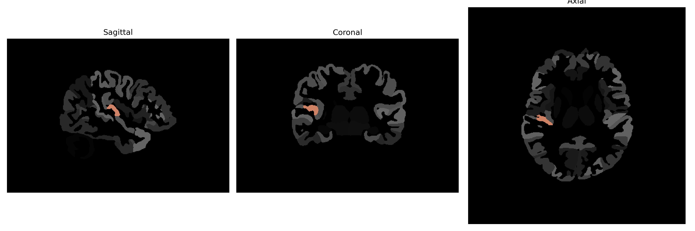

# transverse-temporal-gyrus

## Overview

The right transverse temporal gyrus, also known as Heschl's gyrus, is a region located within the temporal lobe of the brain. It plays a crucial role in auditory processing as it contains the primary auditory cortex, which is responsible for the perception of sound. This gyrus is positioned on the dorsal surface of the superior temporal gyrus, running transversely toward the Sylvian fissure. It is involved in processing the basic characteristics of sound, including frequency, amplitude, and temporal aspects. The specific structure and function of the right transverse temporal gyrus contribute significantly to how auditory information is integrated and interpreted by the brain, making it essential for various aspects of hearing and speech comprehension.

There is no direct Wikipedia link for the description specifically from the brainCOLOR Atlas. However, more information about a related structure can be found at the following URL: https://en.wikipedia.org/wiki/Heschl%27s_gyrus

*Overview generated by GPT-4o (2026).*

---

**Region ID:** 120  
**Hemisphere:** Right  
**Atlas:** brainCOLOR 

---

## Full Brain – Black Background

**Full Quality Version:** [Download MP4](full_black.mp4)

---

## Full Brain – White Background

**Full Quality Version:** [Download MP4](full_white.mp4)

---

## Hemisphere Only – Black Background

**Full Quality Version:** [Download MP4](hemi_black.mp4)

---

## Hemisphere Only – White Background

**Full Quality Version:** [Download MP4](hemi_white.mp4)

---

## Triplanar View (Centered on ROI)

