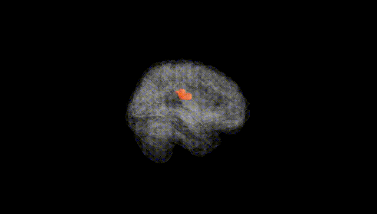
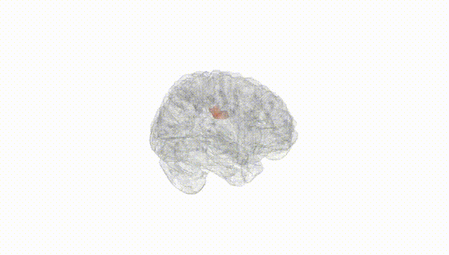
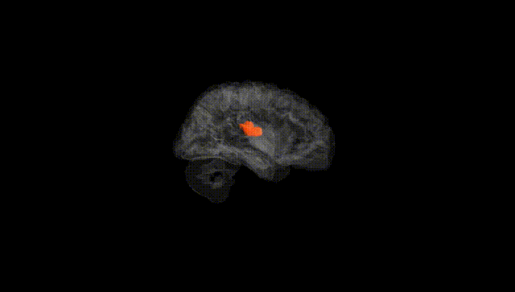
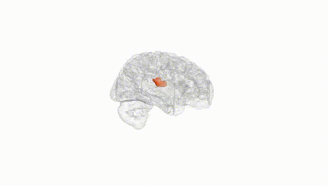
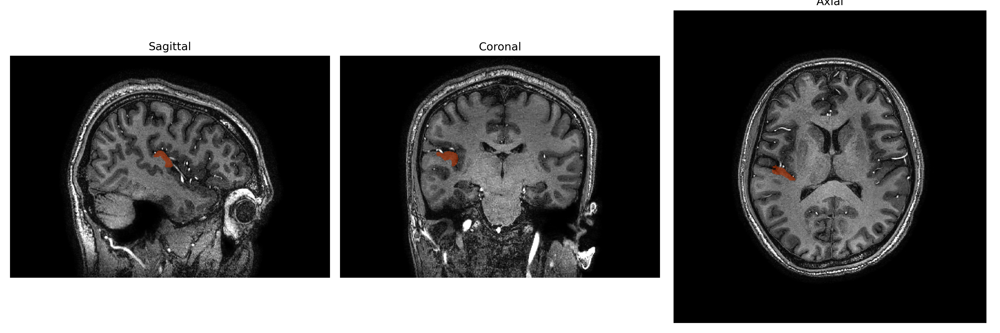
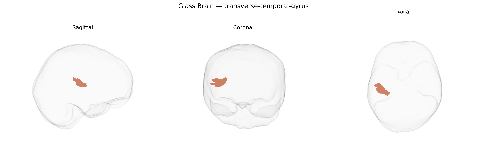

# transverse-temporal-gyrus

## Overview

The right transverse temporal gyrus, also known as Heschl’s gyrus on the right hemisphere, is a cortical region located on the superior surface of the temporal lobe within the lateral (Sylvian) fissure and forms part of the primary auditory cortex (Brodmann areas 41 and parts of 42). It receives dense thalamocortical projections from the medial geniculate nucleus of the thalamus and is organized tonotopically, with neurons arranged according to sound frequency. This region is critical for early-stage auditory signal processing, including sound intensity and frequency discrimination, and contributes to more complex functions such as the analysis of spectral and temporal acoustic features. In the right hemisphere, it is particularly implicated in processing aspects of nonverbal sounds, music perception, and prosodic (intonational and rhythmic) features of speech, and it participates in auditory networks that connect with adjacent superior temporal regions, frontal association cortices, and multimodal integration areas. There is no direct Wikipedia page specifically for the “Right transverse-temporal-gyrus” as defined in the brainCOLOR Atlas; a closely related and encompassing structure is described at: https://en.wikipedia.org/wiki/Heschl%27s_gyrus

*Overview generated by GPT-4o (2026).*

---

**Region ID:** 120  
**Hemisphere:** Right  
**Atlas:** brainCOLOR 

---

## transverse-temporal-gyrus – Black Background (Full Brain)

**Full Quality Version:** [Download MP4](full_black.mp4)

---

## transverse-temporal-gyrus – White Background (Full Brain)

**Full Quality Version:** [Download MP4](full_white.mp4)

---

## transverse-temporal-gyrus – Black Background (Hemisphere)

**Full Quality Version:** [Download MP4](hemi_black.mp4)

---

## transverse-temporal-gyrus – White Background (Hemisphere)

**Full Quality Version:** [Download MP4](hemi_white.mp4)

---

## Triplanar View – T1 Background

---

## Triplanar View – Ghost Brain


