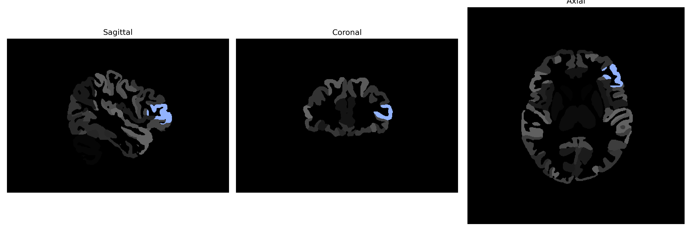

# triangular-part-of-the-IFG

## Overview

The Left Triangular Part of the Inferior Frontal Gyrus (IFG) is a functionally significant region of the frontal lobe in the human brain, belonging to Brodmann area 45. This area is crucial for language processing, notably in grammar and syntax, and plays a role in tasks involving semantic processing and working memory. It forms part of Broca's area, which is pivotal for language production and comprehension. Neuroimaging studies link it to cognitive processes like reasoning and decision-making. This region is interconnected with other parts of the brain involved in complex cognitive behaviors and is a subject of interest in research on language disorders and aphasia.

There is no direct Wikipedia link to the Left Triangular Part of the IFG, but more information can be found on the broader topic of the Inferior Frontal Gyrus here: [Inferior Frontal Gyrus](https://en.wikipedia.org/wiki/Inferior_frontal_gyrus).

*Overview generated by GPT-4o (2026).*

---

**Region ID:** 119  
**Hemisphere:** Left  
**Atlas:** brainCOLOR 

---

## Full Brain – Black Background

**Full Quality Version:** [Download MP4](full_black.mp4)

---

## Full Brain – White Background

**Full Quality Version:** [Download MP4](full_white.mp4)

---

## Hemisphere Only – Black Background

**Full Quality Version:** [Download MP4](hemi_black.mp4)

---

## Hemisphere Only – White Background

**Full Quality Version:** [Download MP4](hemi_white.mp4)

---

## Triplanar View (Centered on ROI)

