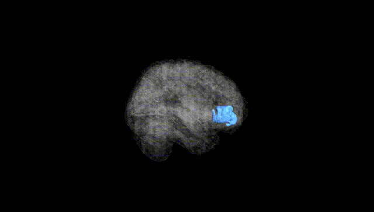
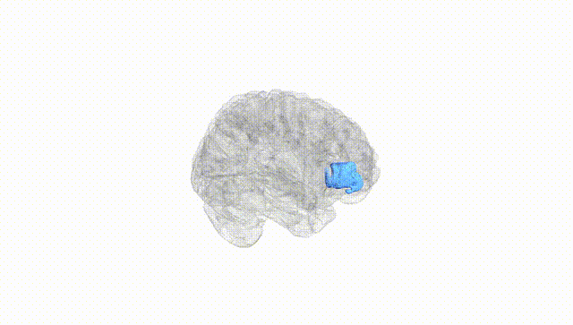
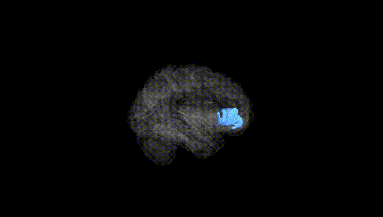
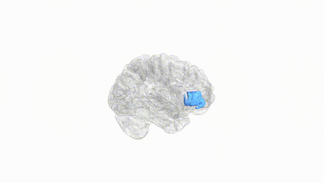
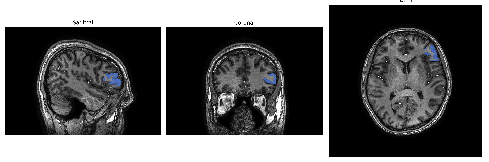
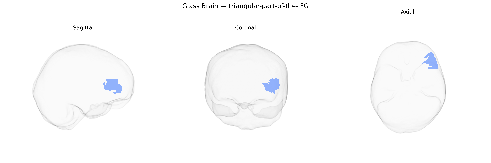

# triangular-part-of-the-IFG

## Overview

The left triangular part of the inferior frontal gyrus (IFG), corresponding largely to Brodmann area 45 (pars triangularis), is a cortical subdivision of the frontal lobe located within the dominant (usually left) hemisphere and forming part of the classical Broca’s region. It lies anterior to the pars opercularis and posterior to the pars orbitalis, bordered inferiorly by the lateral fissure (Sylvian fissure) and superiorly by the inferior frontal sulcus. Cytoarchitectonically, this region is characterized by a granular frontal cortex with distinctive layer IV and pyramidal neurons in layers III and V, supporting its role in higher-order cognitive processing. Functionally, the left triangular part of the IFG is strongly implicated in language processing, including syntactic and semantic operations, controlled retrieval of lexical-semantic information, and aspects of verbal working memory and cognitive control over language-related behaviors. Through its extensive connectivity with temporal, parietal, and other frontal regions, it participates in the broader frontotemporal language network and contributes to speech production, comprehension, and the resolution of linguistic ambiguity.

There is no direct Wikipedia link for “Left triangular-part-of-the-IFG” as defined in the brainCOLOR Atlas; a closely related and encompassing structure is described here: https://en.wikipedia.org/wiki/Inferior_frontal_gyrus

*Overview generated by GPT-4o (2026).*

---

**Region ID:** 119  
**Hemisphere:** Left  
**Atlas:** brainCOLOR 

---

## triangular-part-of-the-IFG – Black Background (Full Brain)

**Full Quality Version:** [Download MP4](full_black.mp4)

---

## triangular-part-of-the-IFG – White Background (Full Brain)

**Full Quality Version:** [Download MP4](full_white.mp4)

---

## triangular-part-of-the-IFG – Black Background (Hemisphere)

**Full Quality Version:** [Download MP4](hemi_black.mp4)

---

## triangular-part-of-the-IFG – White Background (Hemisphere)

**Full Quality Version:** [Download MP4](hemi_white.mp4)

---

## Triplanar View – T1 Background

---

## Triplanar View – Ghost Brain


