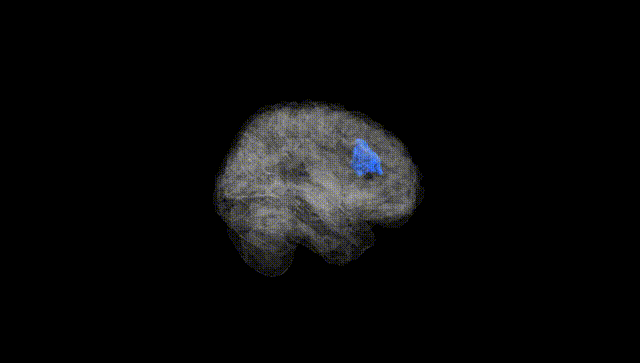
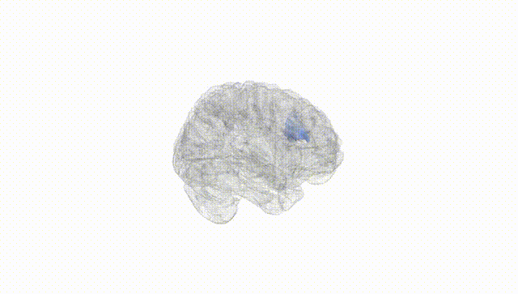
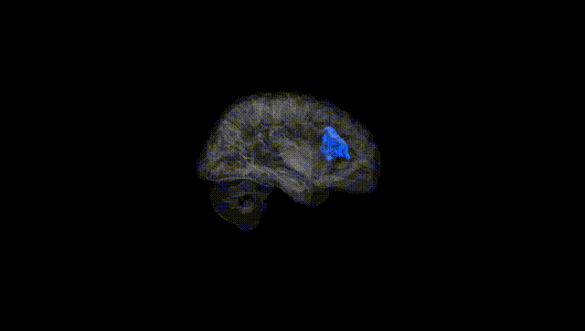
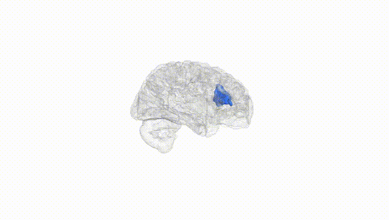
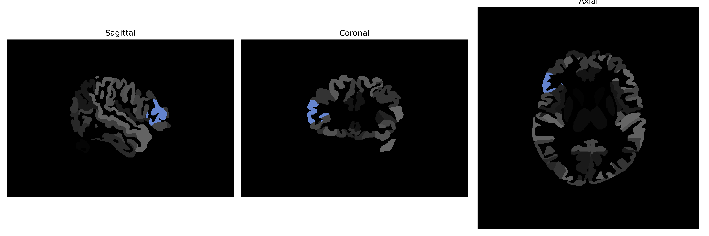

# triangular-part-of-the-IFG

## Overview

The Right triangular-part-of-the-IFG, which stands for the right triangular part of the inferior frontal gyrus, is a region located in the frontal lobe of the human brain. It is part of the inferior frontal gyrus, which plays a crucial role in language processing, including tasks related to syntax and phonological processing. This area is also involved in cognitive functions such as working memory and decision-making. The right side is typically associated with non-verbal and creative tasks, complementing the language-dominant left hemisphere. As part of the prefrontal cortex, the right triangular part of the IFG is essential for higher cognitive functions and is involved in social cognition and the interpretation of others' emotions.

There is no direct Wikipedia link to the Right triangular-part-of-the-IFG. However, a related area that encompasses this region is the "Inferior frontal gyrus," which can be found here: https://en.wikipedia.org/wiki/Inferior_frontal_gyrus.

*Overview generated by GPT-4o (2026).*

---

**Region ID:** 118  
**Hemisphere:** Right  
**Atlas:** brainCOLOR 

---

## Full Brain – Black Background

**Full Quality Version:** [Download MP4](full_black.mp4)

---

## Full Brain – White Background

**Full Quality Version:** [Download MP4](full_white.mp4)

---

## Hemisphere Only – Black Background

**Full Quality Version:** [Download MP4](hemi_black.mp4)

---

## Hemisphere Only – White Background

**Full Quality Version:** [Download MP4](hemi_white.mp4)

---

## Triplanar View (Centered on ROI)

