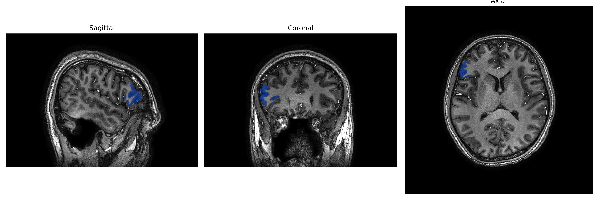
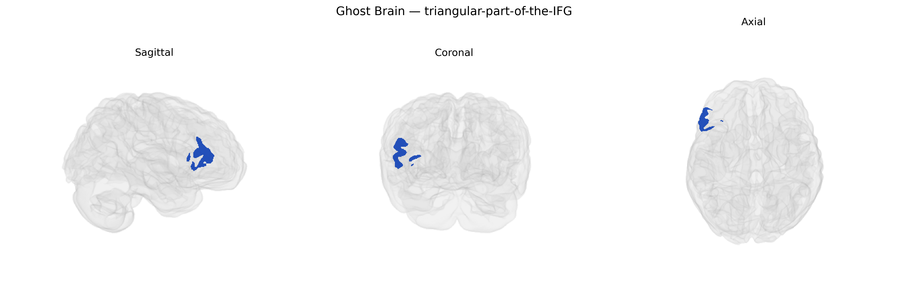

# triangular-part-of-the-IFG
 
## Overview
 
The Right triangular-part-of-the-IFG corresponds to the right pars triangularis of the inferior frontal gyrus, a subdivision of the frontal lobe located anterior to the pars opercularis and dorsal to the pars orbitalis, typically encompassing portions of Brodmann area 45. This region is part of the lateral prefrontal cortex and contributes to higher-order cognitive functions, including aspects of language processing (such as semantic retrieval and controlled selection), response inhibition, and executive control, often in a complementary or modulatory role relative to its left-hemisphere homologue. Structurally, it lies along the inferior frontal sulcus and is bordered inferiorly by the lateral fissure, receiving projections from temporal and parietal association cortices and projecting to other frontal and subcortical regions that support goal-directed behavior and cognitive flexibility. There is no direct link; see [Inferior frontal gyrus](https://en.wikipedia.org/wiki/Inferior_frontal_gyrus).
 
The right triangular part of the inferior frontal gyrus (IFG), corresponding to the right pars triangularis in the brainCOLOR atlas, has been implicated in several genetic and neuropsychiatric contexts, although direct, region-specific genetic associations remain relatively sparse and typically arise from broader imaging genetics or disorder-focused GWAS. Imaging GWAS of cortical morphology and surface area (e.g., ENIGMA and UK Biobank–based studies) have identified common variants near genes involved in neuronal development and synaptic function (such as HMGA2, MIR137, and genes in glutamatergic and GABAergic pathways) that influence inferior frontal cortical thickness, surface area, and gyrification, with some effects lateralized to right frontal regions including the IFG. Polygenic risk scores for schizophrenia, major depressive disorder, bipolar disorder, ADHD, and autism spectrum disorder have been associated with structural and functional alterations in the right IFG, which is a key node in inhibitory control and language-related networks; for example, schizophrenia and ADHD genetic risk correlate with altered right IFG volume or activation during response inhibition tasks, while autism- and language-related genetic risk has been linked to atypical lateralization and connectivity encompassing the right IFG. Additionally, GWAS of traits such as cognitive performance, educational attainment, and impulsivity have identified genetic variants whose brain-structural mediation analyses implicate frontal regions including the right IFG, suggesting that polygenic influences on cognition and self-control may partly act through this region’s morphology and function, though specific single-gene associations uniquely and robustly tied to the right triangular IFG subdivision remain to be clearly established.
 
*Overview generated by GPT-4o (2026).*
 
---
 
**Region ID:** 118  
**Hemisphere:** Right  
**Atlas:** brainCOLOR 
 
---
 
## triangular-part-of-the-IFG – Black Background (Full Brain)
 

 
**Full Quality Version:** <a href="full_black.mp4" download>Download MP4</a>
 
---
 
## triangular-part-of-the-IFG – White Background (Full Brain)
 

 
**Full Quality Version:** <a href="full_white.mp4" download>Download MP4</a>
 
---

## triangular-part-of-the-IFG – Black Background (Hemisphere)
 

 
**Full Quality Version:** <a href="hemi_black.mp4" download>Download MP4</a>
 
---
 
## triangular-part-of-the-IFG – White Background (Hemisphere)
 

 
**Full Quality Version:** <a href="hemi_white.mp4" download>Download MP4</a>
 
---

## Triplanar View – T1 Background
 

 
---
 
## Triplanar View – Ghost Brain
 


