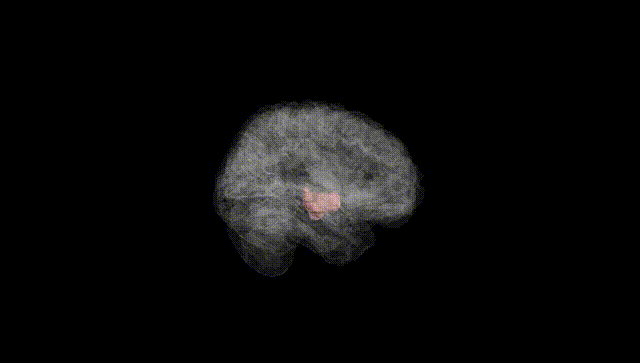
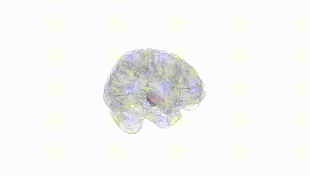
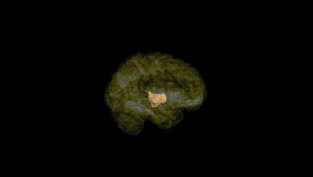
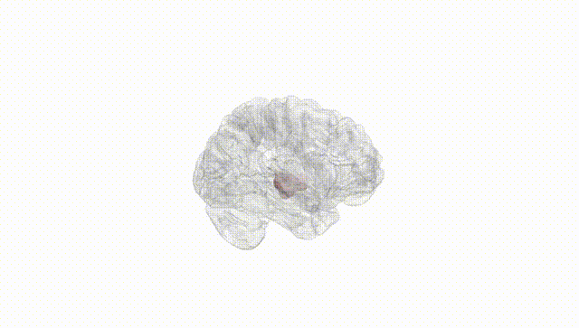
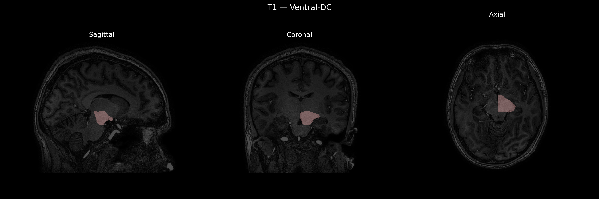
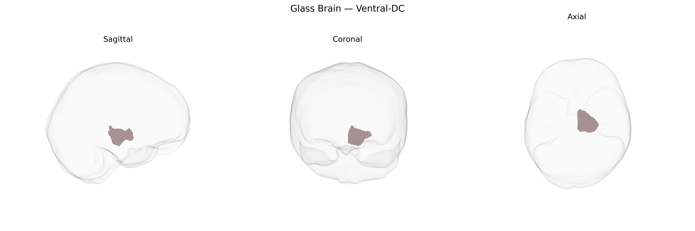

# Ventral-DC
 
## Overview
 
The Left Ventral-DC (diencephalon) region in the brainCOLOR atlas refers to ventral components of the left diencephalon, a central forebrain structure situated between the cerebral hemispheres and the midbrain. This region encompasses ventral thalamic and hypothalamic territories involved in relaying sensory and motor information, regulating autonomic and endocrine functions, and integrating homeostatic processes such as temperature control, hunger, circadian rhythms, and stress responses. Ventral diencephalic nuclei also contribute to limbic and motivational circuits, influencing emotion, arousal, and reward-related behaviors through extensive connections with the brainstem, basal forebrain, and cortex. There is no direct link for “Left Ventral-DC,” but the broader structure is the [Diencephalon](https://en.wikipedia.org/wiki/Diencephalon).
 
Current large-scale neuroimaging genetics resources (including UK Biobank GWAS, ENIGMA, and brain atlases such as brainCOLOR) do not report any robust, region-specific genetic associations uniquely attributed to the Left Ventral-DC (ventral diencephalon) as defined in the brainCOLOR Atlas; instead, genetic findings typically implicate this structure as part of broader subcortical or diencephalic volumes. GWAS of subcortical volumes have identified variants in or near genes such as FAT3, SLC39A8, DRAM1, and others that influence thalamic or diencephalic morphology, but these effects are not usually resolved to the left ventral diencephalon alone. The ventral diencephalon encompasses hypothalamic and related nuclei involved in neuroendocrine, autonomic, reward, and sleep–wake regulation, and genetic variants affecting these functions—such as those associated with obesity and metabolic traits (e.g., near FTO and MC4R), circadian and sleep phenotypes, and stress- or mood-related pathways—are often interpreted as acting partly via diencephalic circuits, though without precise Left Ventral-DC localization. Similarly, psychiatric and neurological GWAS (for depression, schizophrenia, bipolar disorder, and Parkinson’s disease) frequently implicate genes involved in dopaminergic, serotonergic, and synaptic signaling that affect thalamo-striato-cortical and hypothalamic networks, again suggesting a role for ventral diencephalic regions in these disorders, but published studies have not yet established specific, reproducible genetic associations that can be confidently assigned to the Left Ventral-DC parcel of the brainCOLOR Atlas.
 
*Overview generated by GPT-4o (2026).*
 
---
 
**Region ID:** 18  
**Hemisphere:** Left  
**Atlas:** brainCOLOR 
 
---
 
## Ventral-DC – Black Background (Full Brain)
 

 
**Full Quality Version:** <a href="full_black.mp4" download>Download MP4</a>
 
---
 
## Ventral-DC – White Background (Full Brain)
 

 
**Full Quality Version:** <a href="full_white.mp4" download>Download MP4</a>
 
---

## Ventral-DC – Black Background (Hemisphere)
 

 
**Full Quality Version:** <a href="hemi_black.mp4" download>Download MP4</a>
 
---
 
## Ventral-DC – White Background (Hemisphere)
 

 
**Full Quality Version:** <a href="hemi_white.mp4" download>Download MP4</a>
 
---

## Triplanar View – T1 Background
 

 
---
 
## Triplanar View – Ghost Brain
 


